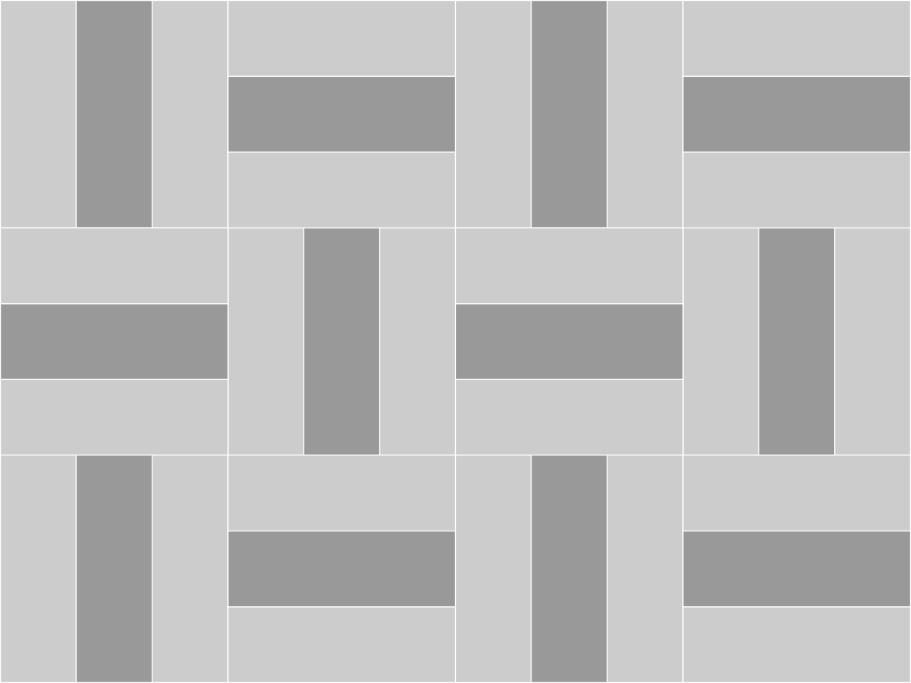
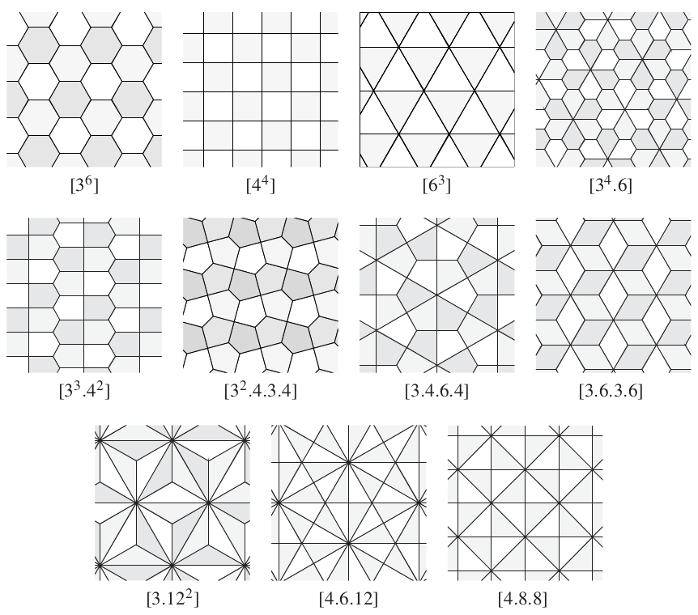
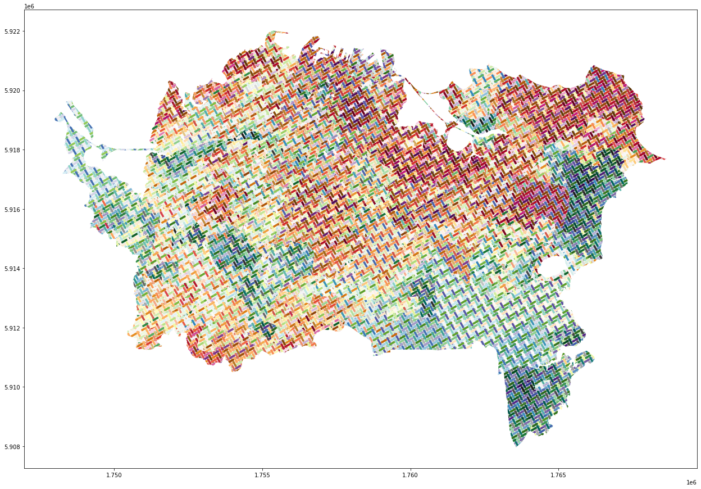

# Tiled maps of multivariate data
**David O’Sullivan** Te Herenga Waka – Victoria University of Wellington Aotearoa – New Zealand

**Luke R. Bergmann** University of British Columbia Vancouver, Canada

Mapping complex multi-attribute data remains a challenging problem for thematic map design. We present an approach based on the idea of ‘tiling’ a map to allow for the simultaneous choropleth colour-based symbolisation of several data attributes. This works extends and generalises earlier work on ‘woven maps’ reported at the State of New Zealand Cartography Seminar *Geospatial Data for New Zealand* meeting held in November 2021.[^OSullivan2021]

The idea behind the approach is that large enough elements (the tiles) in a repeated pattern are present in every polygonal area in the map to properly ‘carry’ colour information that conveys attribute values, but at the same time combinations of attribute values are ‘blended’ by the tiling  pattern to convey an overall impression of different attribute combinations. At the same time, the orientation, shape, and position of tiles in ordered patterns may enable a reader to see connections among places based on similarities in their attribute values.

This work is under active development and we present it as-is to elicit feedback. This paper is therefore more of a progress report than a review of work completed.

In the next section we briefly review other approaches to mapping multivariate data. We then consider some general mathematical ideas underlying tiling, before going on to consider their potential application to mapping problems. 
We show examples of tiled maps, including some where the tiling can be read as a woven pattern. Finally we note many areas for further development of this work.

## Mapping multivariate data
Mapping multivariate data is not a new problem. 
Among many others the following give an idea of the variety of approaches that have been adopted:

- The most obvious approach is *small multiples* where many small maps are arrayed (usually) in a grid. This approach has been strongly recommended by Tufte[^Tufte1990] and is also a common default in statistical mapping packages (for example it is the default output from the `plot()` function in the *R* simple features package `sf` [^Pebesma2018]). The reader has to scan across multiple maps and multiple legends to develop a sense of the relations within and between different attributes across the mapped area. This approach is demanding of relatively large areas on the page or on a screen.

- *Bivariate* or even *trivariate choropleth maps* mix two or three colour ramps to represent two or three numeric attributes in a single map view [^Olson1975]. A related technique is value-by-alpha mapping[^Roth2010]. A serious problem with such approaches is that colour mixes can quickly become ‘muddy’ so that very careful selection of the colour palettes to be mixed is essential.

- *Geographically arranged statistical graphics* can be an effective way to present complex mult-attribute data. Bar charts, box plots, histograms, time series, pie charts and so on can be arranged at or near the centroid of map areas to convey complicated multi-attribute data. A particularly ambitious example of this was Dorling’s Chernoff face cartograms of UK socieconomic and electoral data from the 1980s[^Dorling2012]).

- *Categorical dot maps* symbolise count data for multiple categories. Each dot represents one or more instances of a particular category with different coloured dots used for each category. A well publicised recent example is the Cooper Center’s Racial Dot Map of US Census data (see https://racialdotmap.demographics.coopercenter.org/). Closer to home in their atlas *We Are Here* McDowall and Denee[^McDowall2019] use this approach to map places of work and places of residence in New Zealand cities. The overall effect of such maps is that detailed information can be gleaned ‘close up’ while ‘zoomed out’ colours blend to give an overall impression of the distribution.

We consider the last method described a ‘multi-element pattern’ approach and it shares features with our woven maps particularly the ability to carry detailed information on close inspection and convey and overall impression when viewed at a distance. Because our pattern elements are spatially more extended than dots they can potentially carry richer information (such as position along a numerical range via a colour ramp).

## Elements of tiling
Tiling is an impossibly vast terrain of options. In their classic, encyclopedic (at the time) review of mathematical work on tiling Grünbaum and Shephard[^Grunbaum1987] repeatedly emphasise the need to focus on restricted classes of tilings with specific properties in order to make progress in saying anything useful about tiling at all. More recent work on computational tiling theory indirectly bears out their claim. Systematic enumeration of all tilings with Delaney-Dress symbols of up to size 24[^Dress1985][^Dress1987][^Huson1993] has generated a ‘galaxy’ of 2.4 billion tilings[^Zeller2021], pointing to an unmanageable variety of possible tilings.

Suffice to say, it is well beyond the scope of this paper to even attempt an overview of tiling. Grünbaum and Shephard’s book[^Grunbaum1987] runs to some 700 or so very dense pages. Even more approachable treatments[^Kaplan2009][^Fathauer2021] are demanding reads. Instead we restrict ourselves to translating some key ideas from the mathematical literature on tiling in in ways that seem likely to be useful for taking up tiling in cartographic applications.

### Some definitions
Grünbaum and Shephard[^Grunbaum1987] start with a definition:

> "A *plane tiling* is a countable family of closed sets $\mathcal{T}=\{T_1,T_2,\ldots\}$  which covers the plane without gaps or overlaps. More explicitly, the union of the sets $T_1,T_2,\ldots$ (which are known as the tiles of $\mathcal{T}$ is to be the whole plane, and the interiors of the sets $T_i$ are to be pairwise disjoint” (page 36)

The parallel with how a *coverage* is understood in GIScience is quite striking! The *vertices* and *edges* of a tiling $\mathcal{T}$ are distinct from the *corners* and *sides* of the tiles $T_i$ of which it is composed. Tilings in which every edge of the tiling is also a side of a tile are referred to as *edge-to-edge* which may be an important constraint in some situations. The weave tilings we introduce later break this restriction. At each tiling vertex, the number of edges that meet is the *valence* of the vertex. Many mathematically interesting questions about tilings are posed in relation to their vertex valences. By definition two tiles meet at each tiling edge, and the number of tiles that meet at each vertex is also given by vertex valence.

In tilings composed of regular polygons, each vertex can be described by the number of sides of the polygons incident at it. For example the vertices of the tiling by squares are all $(4\cdot4\cdot4\cdot4)$ usually written $(4^4)$. 
This is termed the *species* of the vertex ([^Grunbaum1987] page 59). Tilings by regular polygons can be designated by listing the vertex species they include. For example, the regular hexagonal tiling is $(6^3)$.

### Symmetry and tilings
Both tiles and tilings may have symmetries, but they are defined slightly differently. 

#### The symmetry groups of a tile
A symmetry of a tile $T_i$ is any transformation $S$ of the Euclidean plane that preserves the shape and size of the tile. Such 'rigid' transformations are referred to as *isometries*. Five isometries are possible:

- The identity (trivially);
- Reflections in lines;
- Rotations at some specified angle around a point;
- Translations by some specified vector; and
- Glide reflections (reflection in a line followed by a translation parallel to the line).

The symmetry group of a tile $G(T)$ is the set of all isometries that preserve its shape, that is $G(T)=\{S\in G:S(T)=T\}$. These fall into three groups:

* Those that contain no translations, but consist only of reflections and/or rotations. These will be either: $c_n$ the $n$-fold *cyclic* symmetry group of rotations by $2\pi k/n$ for $k\in\{1\ldots n\}$; or $d_n$ the *dihedral* group or order $n$ which includes $c_n$ and $n$ reflections in $n$ equally spaced lines that pass through the centre of rotation of $c_n$;
* Those that contain translations along only one direction. These give rise to 7 *frieze* groups [REFERENCE]; and
* Those that contain translations in more than one direction and give rise to the 17 *wallpaper* groups [REFERENCE].

The wallpaper groups are fundamental to tiling and are also referred to as *periodic*. 

#### The symmetry groups of a tiling
The symmetry group of a tiling $G(\mathcal{T})$ is the set of symmetries under which any tile $T_i$ is mapped onto some other tile $T_j$. That is, a symmetry of a tiling is some isometry that permutes or 'shuffles' its tiles. In general, the symmetries of a tiling are not the same as the symmetries of its constituent tiles, but must contain some of them.

It is important to realise that any periodic tiling can be produced given a repeating *tileable unit* (referred to in [^Grunbaum1987] as a *fundamental block*) and two non-parallel translation vectors that are symmetries of the tiling. This is important to grasp, as it means that even apparently very complex tilings can be rendered by identifying a tileable unit. Note that there is no uniquely defined fundamental block of a given tiling. Rather, we are free to choose a fundamental block that is convenient to the task at hand.

### Classifying tilings
Given these definitions, we can think about a number of possible tiling properties.

#### Tile shape and tiling *hedrality*
A $k$-hedral tiling is formed from $k$ distinct shapes of tile (including under reflection and rotation). So, for example the arrowhead and parallelogram tilings in Figure 1 are monohedral.

**Figure 1** Two monohedral tilings

For cartogaphic purposes, it seems like we might want tilings that are $k$-hedral where $k>1$, to allow tiles to be distinguished from one another. But probably what we want is more subtle than this and is a function of the tile symmetries. After all, the arrows in the above tiling are readily distinguished from one another and could be symbolised separately with little danger of confusion.

#### Isohedral tilings and transitivity group
The symmetries of a tiling will map various tiles on to other tiles. The number of sets of tiles related to one another in this way gives rise to the concept of *transitivity groups* of tiles. These are the distinct sets of tiles that are mapped onto one another by the symmetries of the tiling. An *isohedral* tiling has only one transitivity group. An intuitive way to think about this is that the tiles in an isohedral tiling are locally indistinguishable from one another: the tiling looks the same from the perspective of any tile. An isohedral tiling is necessarily also monohedral. 

The concept extends naturally to $k$-isohedrality. It is important to realise that a tiling may be monohedral or $m$-hedral with $m=1$ and $k$-isohedral with $m\neq k$ and in fact that $m\leq k$. A simple example is shown in Figure 2.

**Figure 2** A monohedral tiling that is 2-isohedral

The darker coloured tiles cannot be mapped onto the paler set by any isometry of the tiling, hence the tiling is monohedral but $2$-isohedral. For cartographic purposes that tilings be $k$-isohedral with $k>1$ to allow tiles to be distinguished from one another, although this is by no means clear. For example the tiling in Figure 3 has 4 distinguishable tiles but is isohedral!

**Figure 3** An isohedral tiling that might still admit symbolisation of four different variables

#### The Archimedean tilings
The Archimedean tilings (see Figure 4) are the 11 possible tilings by regular polygons. Since the angles at the corners of a regular polygon with $n$ sides are $\pi(n-2)/n$ and must sum to $2\pi$ where they meet at a tiling vertex, we can see that the vertex species in these tilings must satisfy 

$$\sum_{i=1}^k\frac{n_i-2}{n_i}=2$$

where $k$ non-distinct polygons meet at each vertex. 
Only 17 combinations of integer values of $n$ match this constraint (including such unlikely candidates as $\{3,7,42\}$) but only 11 of these yield tileable configurations:

**Figure 4** The Archimedean tilings (from [^Kaplan2009] page 31)

Three of these are the isohedral and monohedral, regular tilings $(3^6)$, $(4^4)$ and $(6^3)$. These are probably of most interest for mapping applications as they form a basis on which any periodic tiling can be developed, by appropriately sudbdividing or *dissecting* a square or triangle and repeating the result set of 'subtiles' at every 'main tile' in the pattern. The $(3^6)$ tiling by triangles is more complicated than the other two, as it 

#### The Laves tilings
In tiling theory even more important than the Archimedean tilings are their *duals*, the Laves tilings (see Figure 5). The dual of a tiling is obtained by changing vertices in the original tiling to tiles in its dual; and tiles in the original tiling to vertices in the dual. Under these transformations, edges in the original tiling become adjacencies in the dual.

Because the vertices in the Archimedean tilings are of only one species (the tilings are isogonal), the dual tilings (known as the Laves tilings) are isohedral. These are shown below.

**Figure 5** The Laves tilings (from [^Kaplan2009] page 32)

Note that the Laves tilings are designated by the same notation as their Archimedean dual tilings, but enclosed in square brackets. These tilings form the basis for the 81 possible topologically distinct isohedral tilings (first enumerated in [^Grunbaum1987]). Isohedral tilings *per se* may be only limited interested in cartographic applications, but the symmetries of the Laves tilings, seem seem a promising starting point for cartographic applications. 

### Reflections
It is unclear what the import of any of the above might be for choosing or designing tilings suitable for multivariate mapping.

Directionality or orientation is not a property of tilings that mathematicians care about because tiles are considered identical subject to rotation, but it is *probably* an important consideration from a cartographic symbolisation perspective. Many monohedral, isohedral tilings exist that allow for directionally distinguishable tiles given that in mapping we will impose a tiling at some chosen orientation. Thus we may be interested in a looser notion of the transitivity groups of a tiling such that different orientations of a tile 'count' as different for cartographic purposes.

The notion of periodicity in tilings, i.e., that they must have at least two linearly independent (not necessarily orthogonal) translational symmetry vectors is important. There are tilings that have no such symmetry (spiral tilings, for example) which probably hold no interest for cartography. With respect to our implementation of tiled map patterns, periodicity is central, because 'tiling a map' is based on generating a grid of translation vectors from some origin point in the mapped area.

## Making tiled maps
All the tilings we consider are periodic, and can be rendered by repeatedly copying and translating a tileable unit (which may consist of several polygon elements) across the area to be mapped, as shown in Figure 6.

**Figure 6** Schematic illustration of the method. 

We have developed code (the latest version is written in python) that given a `TileUnit` object and a 'region' to be tiled can produce a new geospatial data layer which is a tiling of the region. Using the code consists of the basic steps below:

    unit = TileUnit()
    tiling = Tiling(unit, region, id_var)
    tiled_map = tiling.get_tiled_map(rotation = 0)

The `TileUnit` class contains `elements` and a `tile`, both of which are (small) geospatial datasets. The `tile` is the repeatable tileable shape, either rectangular or hexagonal. The `elements` dataset contains a set of 'subtile' elements each with an `element_id` attribute. The `TileUnit` also has a `tile_shape` attribute designating which kind of grid of tile centres is required to tile a map with the supplied `elements`. The scale of the grid is determined from the dimensions of the `tile`.

A `Tiling` object is constructed from a supplied `TileUnit` and some region to be tiled (itself a geospatial dataset of zones). Based on the `TileUnit`'s `tile_shape` a grid of tile centres is generated and used to copy and translate the `TileUnit`'s `elements` across the extent of the region to be tiled. A larger area than required is tiled and stored so that subsequent calls to the `get_tiled_map` method of the `Tiling` object can request the tiling at different rotations without a need to regenerate the tiling from scratch.

Adopting this approach we have started to explore the possibilities among three broad categories of tiled map as described in the sections below.

### Dissections of the regular tilings
Because ny periodic tiling can be generated based on two non-parallel translation vectors, in some sense _all_ periodic tilings are based on dissections of a parallelogram fundamental block. Here we are more particularly interested in the possibilities offered by dissections of the three regular tilings by triangles, squares or hexagons into 'subtiles'. Figure 7 shows a (nowhere near exhaustive!) enumeration of possibilities up to ten subtiles.

**Figure 7** Some possible tileable units based on dissections of the monohedral tileable regular polygons

As can be seen from the diagram, tilings based on triangles can only be easily dissected into even numbers of subtiles. Rectangular tilings can be readily dissected into a grid.The challenge in using any of these to map a set of attributes is to provide a way for map readers to distinguish among tile sub-elements. One approach is to 'inset' the subtiles within their containing tileable unit, as shown in Figure 8 for 3 and 7 subtile dissections of a hexagonal tile.

**Figure 8** Insetting 3- and 7-subtile dissections of the regular hexagon to allow individual subtiles to be distinguished

A map based on the latter example is shown in Figure 9.

**Figure 9** An example map showing seven different attributes using the 7-subtile dissection of the $(6^3)$ tiling

### Woven maps
Another class of tilings with potential for mapping applications are based on 'woven' patterns. Weave patterns have also been considered by Grünbaum and Shephard[^Grunbaum1988] who designate tilings that could represent weavable patterns as *isonemal fabrics*. More useful for our purposes is an underlying matrix mathematics for working with conventional (biaxial) weaving is presented by Andrew Glassner[^Glassner2002] (see also [^Albaugh2018]). We have extended this approach to represent triaxial woven patterns as three intersecting biaxial weaves. Perhaps surprisingly, it appears that triaxial weaves offer fewer options for variation than conventional weaving[^Mooney1984], although they are visually distinctive enough that it seems useful to implement them.

It is worth noting that weaves provide a convenient way to produce dissections of square and hexagonal tileable units with any reasonable desired number of distinct elements. The flexibility of the approach is shown by the examples in Figure 10, which include biaxial (a-e) and triaxial (f-h) examples, and also cases where the weave itself is a feature (b and c) and missing (e, f, h) or sliced strands (e) are used. (Note that these were produced using an earlier version of our code written in *R* but are also reproducible in the current Python implementation).

**Figure 10** Example weave units: (a) a simple plain weave, (b) a two by two twill weave, (c) a two by two basket weave with two distinct strands in each direction, (d) a plain weave where up to three attributes can be symbolised by vertical strands, and two more by horizontal strands, (e) a biaxial weave with some strands missing or ‘skipped’ to create ‘holes’ through which another map layer might be viewed, and some strands ‘sliced’ to carry more than one data attribute, (f) an open hexagon triaxial weave, (g) the ‘mad weave’ (see Gailiunas 2017) or cube weave, and (h) a cube weave with some strands skipped. The colours in the units denote distinct strands usable to carry different attribute data, not actual colours to be used in mapping. The background grey shading in (a) and (f) shows the extent of the weave unit ‘tile’.

An example map showing the same data as in Figure 9 is shown in Figure 11, using a weave-based tiling.

**Figure 11** An example map showing seven different attributes using a woven pattern

### Other tilings that might be interesting
While dissections of the regular tilings and woven patterns are obvious places to start, as we have noted the possibilities for tiled patterns are endless. Below we show some examples generated using our current code-base which (we hope) illustrate the potential of the approach.

**Figure 12** 'Escher' style tiled map showing four variables all symbolised on the same colour palette. Correlated and uncorrelated regions appear clearly distinguishable

**Figure 13** Arrow tiles. Here the opposite directions of the arrow shaped tiles make clear that they symbolise different attributes, even though the tiling is formally both monohedral and isohedral

**Figure 13** A set of circular annuli used to symbolise several attributes and tiled on a hexagonal grid. This shows a very different approach where the tile is not a tile as such, but a 'bearer' of a motif.

## Further work
As we have stated this work is at a preliminary stage. Code for making woven maps as described is available at https://github.com/DOSull/weaving-space although it remains under development and is subject to rapid change. 

Many questions remain around the design of such maps, among them
- How does colour work in this setting? What kinds of colour combinations are usable, and how does what is usable or not depend on data distributions and relations among attributes?
- What symbolisation schemes work? Are continuous colour ramps, classified colour ramps workable, or is the approach most suitable for categorical data? (as originally applied in Chaves et al. 2021)
- Tiled maps demand a better understanding of how ‘orientation’ in particular works as a visual variable and more work is required to develop such an understanding.

Ultimately tiled maps are an exploration of the application of pattern and texture as visual variables and we hope that this work can contribute to an improved understanding of the many possibilities for creative cartographic design in this space. 

## References
[^Albaugh2018]: Albaugh L. 2018. “It’s just matrix multiplication!” Notation for weaving. Presented at *Strange Loop Conference*, St Louis, 27-28 September. Video available at [youtube.com](https://youtube.com/watch?v=oMOSiag3dxg)
[^Bertin1983]: Bertin J. 1983. *Semiology of Graphics*. Madison, WI: University of Wisconsin Press.
[^Dorling2012]: Dorling D. 2012. *The Visualization of Spatial Social Structure*. Chichester, England: John Wiley & Sons.
[^Dress1985]: Dress AWM. 1985. Regular polytopes and equivariant tessellations from a combinatorial point of view, in *Algebraic Topology Göttingen 1984* Ed L Smith, Berlin Heidelberg: Springer. pages 56–72. doi:[https://dx.doi.org/10.1007/BFb0074423](10.1007/BFb0074423)
[^Dress1987]: Dress AWM and DH Huson. 1987, On tilings of the plane. *Geometriae Dedicata* **24**(3) 295–310. doi:[https://dx.doi.org/10.1007/BF00181602](10.1007/BF00181602)
[^Huson1993]: Huson DH. 1993. The generation and classification of tile-k-transitive tilings of the Euclidean plane, the sphere and the hyperbolic plane. *Geometriae Dedicata* **47**(3) 269–296. doi:[https://dx.doi.org/10.1007/BF01263661](10.1007/BF01263661) 
[^Fathauer2021]: Fathauer RW. 2021. *Tessellations: Mathematics, Art, and Recreation*. Boca Raton: AK Peters/CRC Press.
[^Gailiunas2017]: Gailiunas P. 2017, Mad weave. *Journal of Mathematics and the Arts* **11**(1):40–58. 
doi:[https://dx.doi.org/10.1080/17513472.2016.1273037](10.1080/17513472.2016.1273037)
[^Glassner2002]: Glassner A. 2002. Digital weaving. 1. *IEEE Computer Graphics and Applications* **22**(6):108–118. doi:[https://dx.doi.org/10.1109/MCG.2002.1046635](10.1109/MCG.2002.1046635)
[^Grunbaum1987]: Grünbaum B and GC Shephard. 1987. *Tilings and Patterns* New York: W. H. Freeman and Company.
[^Grunbaum1988]: Grünbaum B and GC Shephard. 1988. Isonemal Fabrics. *The American Mathematical Monthly* **95**(1):5–30. doi:[https://dx.doi.org/10.1080/00029890.1988.11971960](10.1080/00029890.1988.11971960)
[^Kaplan2009]: Kaplan CS. 2009. *Introductory Tiling Theory for Computer Graphics* (Morgan & Claypool, S.l.)
[^McDowall2019]: McDowall C and T Denee. 2019. *We Are Here: An Atlas of Aotearoa* Auckland, Massey University Press, Auckland.
[^Mooney1984]: Mooney DR. 1984. Triaxial Weaves and Weaving: An Exploration for Hand Weavers. *Ars Textrina* **2**:9–68.
[^Olson1975]: Olson JM. 1975. The organization of color on two-variable maps. In *Proceedings of the International  Symposium on Computer-Assisted Cartography* (Auto-Carto II), 289–94.
[^OSullivan2021]: O’Sullivan D and LR Bergmann. 2021. Weaving maps of multivariate data. Presentation at State of New Zealand Cartography Seminar *Geospatial Data for New Zealand*, National Library of New Zealand, Wellington, 12 November. See https://dosull.github.io/weaving-space/NZCS-Nov-2021/make-weave-map.html (accessed 5 May 2022).
[^Pebesma2018]: Pebesma E. 2018. Simple Features for R: Standardized Support for Spatial Vector Data. *The R Journal* **10**(1):439. doi:[https://dx.doi.org/10.32614/RJ-2018-009](10.32614/RJ-2018-009)
[^Roth2010]: Roth RE, AW Woodruff, and ZF Johnson. 2010. Value-by-alpha Maps: An Alternative Technique to the Cartogram. *The Cartographic Journal* **47**(2):130–140. doi:[https://dx.doi.org/10.1179/000870409X12488753453372](10.1179/000870409X12488753453372)
[^Tufte1990]: Tufte ER. 1990. *Envisioning Information*. Cheshire, CT: Graphics Press.
[^Zeller2021]: Zeller R, O Delgado-Friedrichs and DH Huson. 2021. Tegula – exploring a galaxy of two-dimensional periodic tilings. *Computer Aided Geometric Design* **90** 102027. doi:[https://dx.doi.org/10.1016/j.cagd.2021.102027]

