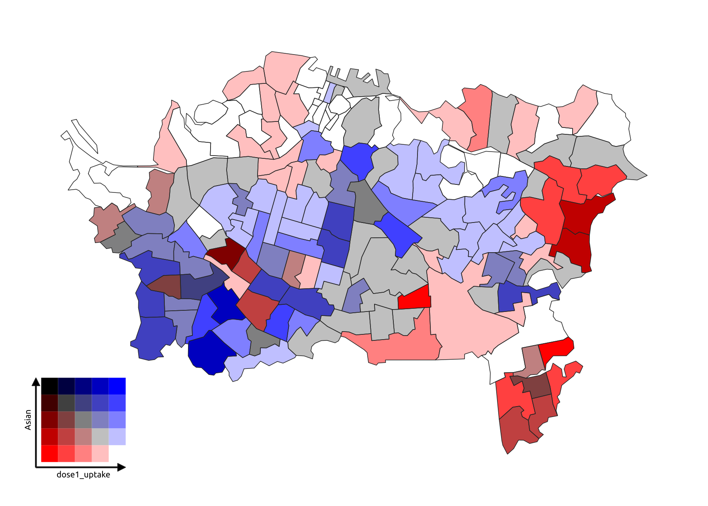
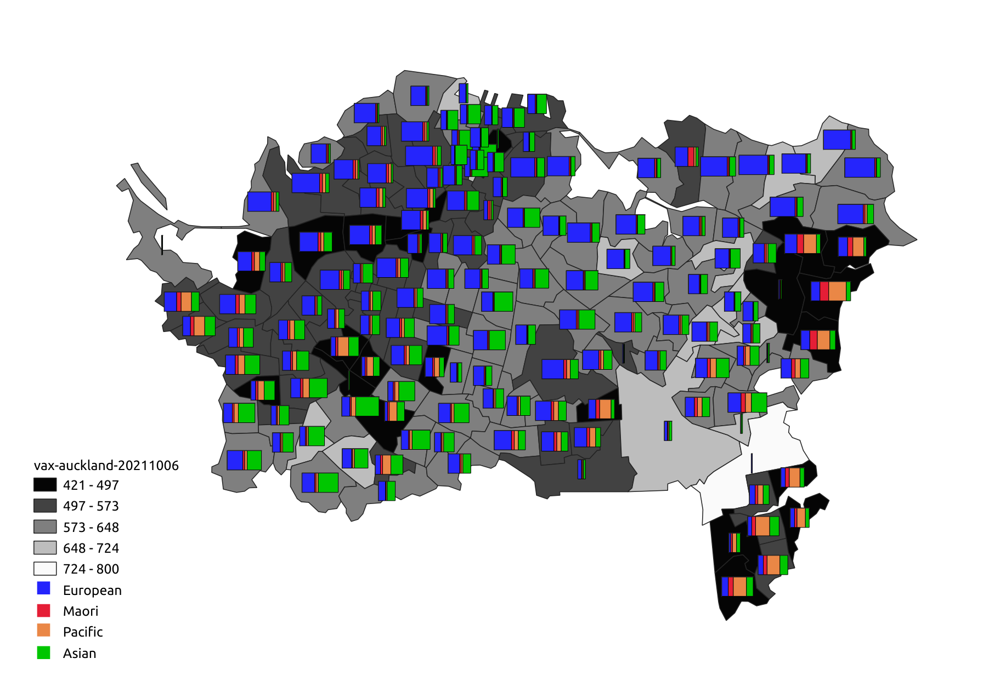
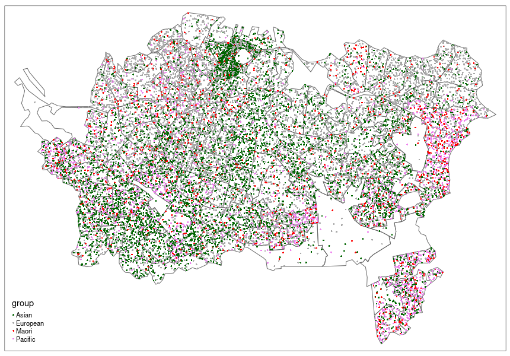
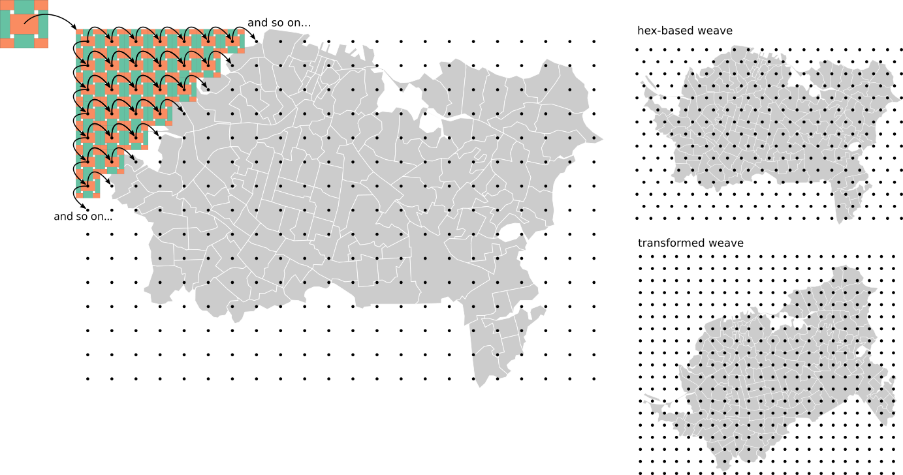

```{r, setup, include=FALSE}
knitr::opts_knit$set(root.dir = 
                       "~/Documents/code/weaving-space"
                       )
```

```{r message = FALSE, echo = FALSE, warning = FALSE, results = FALSE}
source("weaving-space-utils.R")
source("biaxial-weave-units.R")
source("triaxial-weave-units-geometric.R")
source("render-weave-grids.R")
source("weave-map.R")

library(sf)        # vector spatial data
library(tmap)      # thematic maps
library(dplyr)     # data wrangling
library(anthromes)

library(ggplot2)   # plotting
library(tricolore) # trivariate choropleths
library(ggtern)    # trivariate legend

region <- st_read("data/vax-auckland-20211006.gpkg")
```


Weave pattern maps where each 'thread' or 'strand' represents a different attribute that can be independently symbolised.

Here is the map in a recent paper that got us thinking about this idea (click for a closer look).

. _Socio-Economic Planning Sciences_.](images/chaves-et-al-2021-example.jpg)

A key aspect is the way that strands in the weave link across boundaries, and the way that directionality in the pattern allows distinct patterns in more than one attribute to be simultaneously viewed.

This map was done with SVG symbol fills in QGIS, and was (very!) fiddly to produce. Nevertheless we thought the general idea has merit and decided to develop it further


# Motivation and other approaches
Increasingly, we deal with highly multivariate data. Many approaches can be used to visualise such data spatially, and we consider a few below.

## Small multiples
This is `sf`'s default plot output for a dataset.

```{r warning = FALSE, message = FALSE}
plot(region)
```

Small multiples can be effective, but require cross-comparison by eye among multiple, perhaps detailed, and necessarily small maps. They need a lot of screen or paper real estate.


## Bivariate choropleths 
This idea has been around for over 50 years, yet remains hard to execute well, e.g., using [Jan Caha's QGIS plugin](https://jancaha.github.io/qgis-plugin-bivariate-renderer/) which implements an approach described by Joshua Stevens in [this post](https://www.joshuastevens.net/cartography/make-a-bivariate-choropleth-map/).



Of course the method is limited to two colours.


## Trivariate choropleths
Mixing three colours is hard, but e.g., the [`tricolore`](https://github.com/jschoeley/tricolore) package can do this...

```{r message = FALSE, warning = FALSE}
eth_mix <- tricolore::Tricolore(
  region, p1 = "pEuropean", p2 = "pMaori", p3 = "pAsian", breaks = 5
)
region$eth_mix_tri <- eth_mix$rgb

ggplot(region) + 
  geom_sf(aes(fill = eth_mix_tri)) + 
  scale_fill_identity() +
  annotation_custom(
    grob = ggplotGrob(eth_mix$key + labs(L = 'Pākehā', T = 'Māori', R = 'Asian')),
    xmin = 1.7465e6, xmax = 1.7535e6, ymin = 5.9075e6, ymax = 5.9125e6)
```

The problem is that blends of three colours have a tendency to all end up muddy browns!


## Symbols over choropleths
A straightforward option is to display small statistical graphics, such at time series, histograms, pie charts, box plots on top of a standard map view. Here's an example made in QGIS.




## Multivariate symbols
The classic example is Dorling's Chernoff faces map of the UK 1987 election.

. Chichester, England: John Wiley & Sons.](images/dorling-chernoff-faces.jpg)

This example combines a cartogram representation for location of the constituencies, coloured according to a trivariate scheme, with four additional variables represented in the face symbols.


## Multi-element patterns
There are many variations on this idea, but perhaps the most common is a categorical dot map. The example below was made using `tmap` and data preparation code from [James Smythe's cultureofinsight blog](https://www.cultureofinsight.com/post/multivariate-dot-density-maps-in-r-with-sf-ggplot2)



Here each dot represents ~25 people and colours represent different census-classified ethnicities. This approach can be very effective (see for example the Cooper Center's [Racial Dot Map](https://racialdotmap.demographics.coopercenter.org/)), although great care is required in placing&mdash;and in interpreting the placement of&mdash;the dots

This last approach is closest in spirit to ours, as it seeks to allow the different symbolisations to be seen together and also partly dissolves the polygon boundaries that underpin the data.


# A woven map
Below we show a woven map and the code that produced it.

Our code allows a _weave unit_ in `sf` format to be constructed (more on these [later](#weave-units-or-fundamental-blocks)), and then applied using a `weave_layer()` function to create a _weave layer_ (here, the variable `fabric`, with an attribute `strand` identifying each strand in the weave

```{r warning = FALSE, message = FALSE, results = FALSE, eval = FALSE}
weave_unit <- get_biaxial_weave_unit(spacing = 200, type = "twill", n = 3, 
                                     aspect = 0.6, strands = "ab|cd", 
                                     crs = st_crs(region))
fabric <- weave_layer(weave_unit, region, angle = 30)
```

```{r echo = FALSE, message = FALSE, warning = FALSE, results = FALSE}
fabric <- st_read("data/fabric-raw.gpkg")
tmap_mode("view")
tmap_options(check.and.fix = TRUE)
```

We can split the data by `id` attribute of `fabric` to make symbolising them independently easier

```{r}
layers <- fabric %>% split(as.factor(fabric$strand))
```

Below we make the map using the `tmap` package but this could be done in any GIS-adjacent tool since the weave layer is a standard geospatial dataset, not a graphical overlay

```{r warning = FALSE, message = FALSE}
tm_shape(region, name = "Dose 2 uptake") +
  tm_fill(col = "dose2_uptake", palette = "inferno", style = "cont", 
          title = "Dose 2 per 1000", id = "SA22018_V1_00_NAME") +
  tm_shape(layers$a, name = "Pākehā") +
  tm_fill(col = "pEuropean", palette = "Greys", title = "% Pākehā", n = 3, 
          id = "SA22018_V1_00_NAME", popup.vars = c("pEuropean")) +
  tm_shape(layers$b, name = "Māori") +
  tm_fill(col = "pMaori", palette = "Reds", title = "% Māori", n = 3, 
          id = "SA22018_V1_00_NAME", popup.vars = c("pMaori")) +
  tm_shape(layers$c, name = "Pasifika") +
  tm_fill(col = "pPacific", palette = "Purples", title = "% Pasifika", n = 3, 
          id = "SA22018_V1_00_NAME", popup.vars = c("pPacific")) +
  tm_shape(layers$d, name = "Asian") +
  tm_fill(col = "pAsian", palette = "Greens", title = "% Asian", n = 3, 
          id = "SA22018_V1_00_NAME", popup.vars = c("pAsian"))
```

[Online full screen version](example-map-1.html)


# Implementing woven maps
Our implementation is conceptually straightforward:

A weave unit 'tile' is generated and replicated and tiled across a regular rectangular or hex grid of points generated by geospatial tools (here we use `sf::st_make_grid`

We can also affine transform (skew, magnify, rotate, etc) the weave by applying the inverse transform to the map area before doing the tiling, then inverting the transformations



The question is: "What repeatable units can tile across such grids to give the appearance of a woven pattern?" 

It turns out this has been of interest to mathematicians (Grünbaum and Shephard [1985](https://dx.doi.org/10.1111/j.1749-6632.1985.tb14560.x), [1986](https://dx.doi.org/10.1016/0012-365X(86)90010-5)), who call such tileable elements the _fundamental blocks_ ('tiles') of _isonemal fabrics_ (weave patterns)

Our proof-of-concept _R_ tools follow this sequence to make weave patterns:

1. [Make a weave unit](#weave-units)
2. [Tile the map area with the weave unit](#weave-a-map)
3. [Export to a multi-layer GPKG](#write-the-weave-layers)
4. Symbolise the weave elements as desired in _any_ tool


# Weave units (or fundamental blocks)
We have implemented a wide range of weave units, both [biaxial](#biaxial-weaves) and [triaxial](#triaxial-weaves)

## Biaxial weaves
We generate biaxial weave units using a matrix multiplication method (see [Glassner 2002](https://dx.doi.org/10.1109/MCG.2002.1046635))

### Plain weaves
Traditional over-under weave patterns with threads in two directions, the warp (north-south!) and the weft (east-west!) 

Simplest is a plain weave

```{r warning = FALSE}
rect11_unit <-   ## plain weave example
  get_biaxial_weave_unit(spacing = 300, type = "plain",
                    strands = "a|b", crs = st_crs(region))
rect11_unit$primitive %>% plot(border = NA, main = "Plain weave unit")
```

This will produce a checkerboard pattern when tiled

The colours are _not_ the final colours that would be applied to a map, but denote map areas that would be symbolised differently

This simple pattern could be useful if clearly distinct palettes were used in the warp and weft elements 

More useful is if we change the aspect of the weave unit elements so that we can distinguish directions

```{r warning = FALSE}
rect11_unit <-   ## plain weave example
  get_biaxial_weave_unit(spacing = 300, aspect = 0.8,
                    strands = "a|b", crs = st_crs(region))
rect11_unit$primitive %>% plot(border = NA, main = "Plain weave unit, with directions")
```

### More threads, more colours
The weave  is highly customisable

We can add more unique strands in either or both directions

This unit might be used to map 5 attributes

```{r warning = FALSE}
rect32_unit <-
  get_biaxial_weave_unit(spacing = 300, aspect = sqrt(0.5), 
                    strands = "abc|de", crs = st_crs(region))
rect32_unit$primitive %>% plot(border = NA, main = "Plain weave, 3 warp and 2 weft colours")
```

### Missing threads
We can even leave gaps or duplicate threads

```{r warning = FALSE}
rect34_unit <-   ## plain weave example
  get_biaxial_weave_unit(spacing = 150, aspect = 0.8,
                    strands = "ab-|cc-d", crs = st_crs(region))
rect34_unit$primitive %>% plot(border = NA, main = "Complex plain weave with missing strands")
```

### Twill weaves and basket weaves
There are many different weave patterns

In twill weaves an over-under pattern (here 2-2) shifts one strand between consecutive weft strands to produce a distinctive diagonal pattern

```{r warning = FALSE}
twill_unit <- 
  get_biaxial_weave_unit(spacing = 150, type = "twill", n = c(2, 2), 
                         aspect = 0.7, strands = "a|b", crs = st_crs(region))
twill_unit$primitive %>% plot(border = NA, main = "2 over 2 under twill weave")
```

In basket weaves, an over-pattern repeats between consecutive weft strands to give a checkerboard appearance, but note that more than one colour might be applied in either or both directions

```{r warning = FALSE}
basket_unit <- 
  get_biaxial_weave_unit(spacing = 150, type = "basket", n = 2, 
                         aspect = 0.7, strands = "ab|cd", crs = st_crs(region))
basket_unit$primitive %>% plot(border = NA, main = "2 over 2 under basket weave")
```

### Other weaves
Because we are using a matrix multiplication approach, we can generate any biaxial weavable pattern, even crazy ones, like this:

```{r warning = FALSE}
this_unit <- 
  get_biaxial_weave_unit(spacing = 37.5, type = "this", strands = ids,
                        crs = st_crs(region))
this_unit$primitive %>% plot(border = NA, main = "Pattern from Glassner 2002")
```


## Triaxial weaves
We've made less progress (so far) with triaxial weaves, largely because we have yet to figure out a flexible underlying representation and instead are relying on 'pure geometry'

### Hexagonal
This weave has strands running in 3 directions, and uses a hexagonal tiling

We can 'split' strands along their length to allow more attributes

```{r warning = FALSE}
hex_unit <- ## hex example
  get_triaxial_weave_unit(spacing = 600, margin = 2,
                          strands = "a|bc|def", type = "hex", crs = st_crs(region))
hex_unit$tile %>% plot(col = "white", border = "black", 
                       main = "Hex-based triangular weave")
hex_unit$primitive %>% plot(border = NA, add = TRUE)
```

A cube is another option (sometimes called 'madweave')

This produces some odd 3D effects when tiled (see below)

```{r warning = FALSE}
cube_unit <-
  get_triaxial_weave_unit(spacing = 600, strands = "ab|cd|ef", margin = 2, 
                          type = "cube", crs = st_crs(region))
cube_unit$primitive %>% plot(border = NA, 
                             main = "Mad weave (so called) with two colours in each direction")
```

### Diamond
An alternative way to produce a triangular weave is with a diamond repeating unit with angles 60&deg; and 120&deg;

```{r warning = FALSE}
diamond_unit <-   ## diamond example
  get_triaxial_weave_unit(spacing = 600, margin = 2,
                          strands = "a|b|c", type = "diamond", crs = st_crs(region))
diamond_unit$tile %>% plot(col = NA, border = "black",
                           main = "Triangular weave with a diamond fundamental block")
diamond_unit$primitive %>% plot(border = NA, add = TRUE)
```


# Weave a map
As another example here are some data from [Ellis et al. 2021](https://doi.org/10.1073/pnas.2023483118), which aim to show change over 1000s of years in human-affected regions they designate as _anthromes_

First, a small multiple approach

```{r warning = FALSE, message = FALSE, results = FALSE}
anthromes <- st_read("data/nz-anthromes-dgg.gpkg")
tmap_mode("plot")
tm_shape(anthromes) + 
  tm_fill(col = paste("class", seq(2000, 1800, -100), sep = ""), 
          palette = anthrome_colors(), title = "Anthrome") +
  tm_layout(panel.labels = c("2000", "1900", "1800"), 
            legend.outside = TRUE)
```

And now we make a weave unit and tile it so we can put three snapshots in a single map

```{r message = FALSE, warning = FALSE, results = FALSE, eval = FALSE}
tri_unit <- get_triaxial_weave_unit(spacing = 8000, strands = "a|b|c", type = "hex", 
                                    crs = st_crs(anthromes))
fabric2 <- weave_layer(tri_unit, anthromes, angle = 15)
```

Some tidying up is needed for the web map hover labelling (we need to make this easier to carry out as part of the `weave_layer()` function)

```{r message = FALSE, warning = FALSE, results = FALSE}
fabric2 <- st_read("data/fabric2-raw.gpkg") %>%   
  mutate(label = if_else(strand == "a", 
                         paste("1800", class1800),               # make labels including
                         ifelse(strand == "b",                       # year and anthrome
                                paste("2000", class2000), 
                                paste("1900", class1900)))) %>% 
  select(21, 1:19)                                               # put them in 1st column
layers2 <- fabric2 %>% split(as.factor(fabric2$strand))

tmap_mode("view")
```

The map itself is simple enough to make in `tmap`

```{r warning = FALSE, message = FALSE}
tm_shape(layers2$a, name = "1800") +
  tm_fill(col = "class1800", palette = anthrome_colors(), legend.show = FALSE) +
  tm_shape(layers2$c, name = "1900") +
  tm_fill(col = "class1900", palette = anthrome_colors(), legend.show = FALSE) +
  tm_shape(layers2$b, name = "2000") +
  tm_fill(col = "class2000", palette = anthrome_colors(), title = "Anthrome")
```

Also see: [online full screen version of the above map](example-map-3.html)

Also see: [A comparison of cube weaves for this data](make-weave-map_cartographic-appendix.html)--experimenting with whether to have strand segments only have a single colour of the data that has the most area within each segment or leaving strands coloured, as above, with data boundaries visibly breaking up strands. 


# Write the weave layers
We don't expect everyone to use _R_ for their maps, so we can save out to a multi-layer GPKG for use in any tool (alternatively the un-split layer can be saved to any spatial format as required)

```{r eval = FALSE}
write_weave_layers(fabric, region, "data/fabric.gpkg")
write_weave_layers(fabric2, anthromes, "data/fabric2.gpkg")
```


# Further work
There is lots to do (at least potentially!)

+ Clarify the API for the tools to make their usage clearer
+ Figure out how to make legends...
+ Develop guidelines for what works (and what doesn't)
+ Figure out how colour work in this setting (how many, what combinations?)
+ Explore what symbolisations work (continuous, classified, categorical?)
+ Understand better how orientation operates
+ Consider the use of 'gaps' in a weave pattern
+ Ultimately an exploration of pattern and texture as visual variables


# Acknowledgments

+ Thanks to co-conspirator [Luke Bergmann (UBC)](https://geog.ubc.ca/profile/luke-bergmann/)
+ You'll find code at [github.com/DOSull/weaving-space](https://github.com/DOSull/weaving-space)


## References
Ellis EC, N Gauthier, K Klein Goldewijk, R Bliege Bird, N Boivin, S Díaz, DQ Fuller, JL Gill, JO Kaplan, N Kingston, H Locke, CNH McMichael, D Ranco, TC Rick, MR Shaw, L Stephens, J-C Svenning and JEM Watson. 2021. [People have shaped most of terrestrial nature for at least 12,000 years](https://doi.org/10.1073/pnas.2023483118). _Proceedings of the National Academy of Sciences_ **118**(17):e2023483118.

Gauthier N, E Ellis and K Klein Goldewijk. 2021. [Anthromes 12K DGG (V1) Full Dataset](https://dataverse.harvard.edu/citation?persistentId=doi:10.7910/DVN/E3H3AK). (last accessed 10 November 2021).

Glassner A. 2002. [_Digital weaving 1_](https://dx.doi.org/10.1109/MCG.2002.1046635). IEEE Computer Graphics and Applications **22**(6):108–118.

Glassner A. 2003a. [_Digital weaving 2_](https://dx.doi.org/10.1109/MCG.2003.1159616). IEEE Computer Graphics and Applications **23**(1):77–90.

Glassner A. 2003b. [_Digital weaving 3_](https://dx.doi.org/10.1109/MCG.2003.1185583). IEEE Computer Graphics and Applications **23**(2):80–83.

Griswold R. 2006 (unpublished manuscript). [Mathematical and Computational Topics in Weaving](https://www2.cs.arizona.edu/patterns/weaving/webdocs/mo/Griswold-MO.pdf) (last accessed 29 October 2021).

Grünbaum B and GC Shephard. 1985. [_A catologue of isonemal fabrics_](https://dx.doi.org/10.1111/j.1749-6632.1985.tb14560.x). _Annals of the New York Academy of Sciences_ **440**(1 Discrete Geom):279–298.

Grünbaum B and GC Shephard. 1986. [_An extension to the catalogue of isonemal fabrics_](https://dx.doi.org/10.1016/0012-365X(86)90010-5). Discrete Mathematics **60**:155–192.

And this video by Lea Albaugh provided a nice way in to the topic for us: ["It's Just Matrix Multiplication": Notation for Weaving](https://www.youtube.com/watch?v=oMOSiag3dxg), presented at the Strange Loop conference, St Louis, 27-28 Sept, 2018. 


## Questions?
