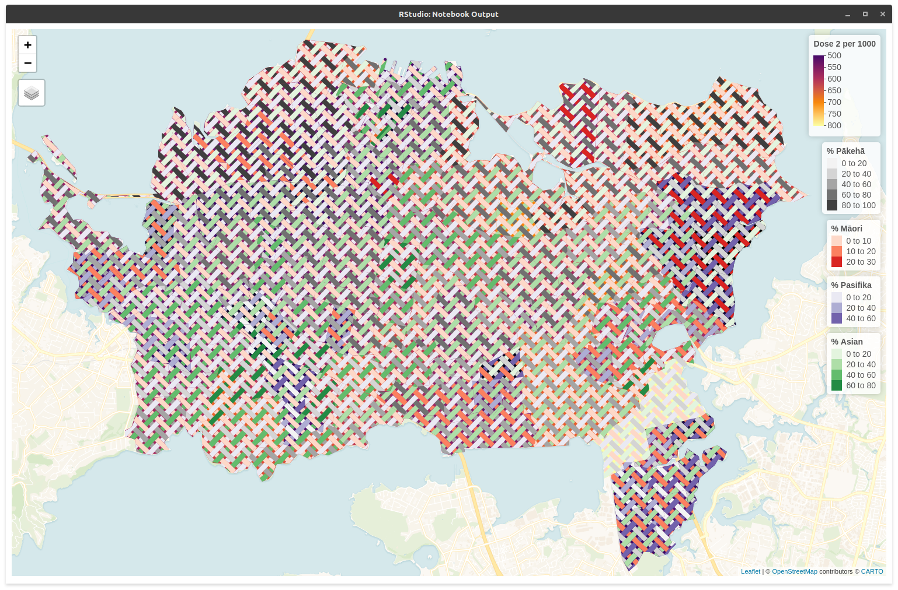

# Geographical weaving
This is work in progress towards developing tiled 'woven' geospatial data layers for symbolisation of complex multi-attribute choropleths.  

The working code is all in R and Rmd files in this top level folder. Needed datasets to run the code are in the `data` folder.

The kind of thing we can make is this:

Some older abortive work in python is in the `python-stuff` folder.

Some sketches figuring things out are in `sketches`.

An overview of the concepts can be found on [this webpage](https://dosull.github.io/weaving-space/NZCS-Nov-2021/make-weave-map.html).

# Triaxial weaves as combinations of biaxials
This [work-in-progress](ttps://dosull.github.io/weaving-space/three-way-matrices.html) summarises progress on this topic.

## Notes
The follow documents describe aspects of the project

+ [Notes on biaxial weave implementation](https://dosull.github.io/weaving-space/notes-on-biaxial-weave-implementation.html) as at [25 Nov 2021](https://github.com/DOSull/weaving-space/commit/735c6a828f682c52afd0fddf3570ce5fa4badaf3)
+ [Notes on triaxial weave implementation](https://dosull.github.io/weaving-space/notes-on-triaxial-weave-implementation.html) as at [25 Nov 2021](https://github.com/DOSull/weaving-space/commit/735c6a828f682c52afd0fddf3570ce5fa4badaf3)
+ [Towards triaxial weaves using matrices](https://dosull.github.io/weaving-space/towards-triaxial-weaves-using-matrices.html) as at [25 Nov 2021](https://github.com/DOSull/weaving-space/commit/735c6a828f682c52afd0fddf3570ce5fa4badaf3)
