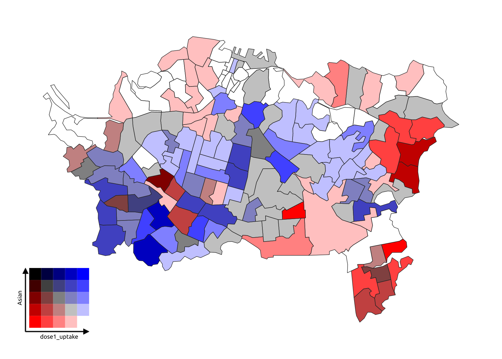
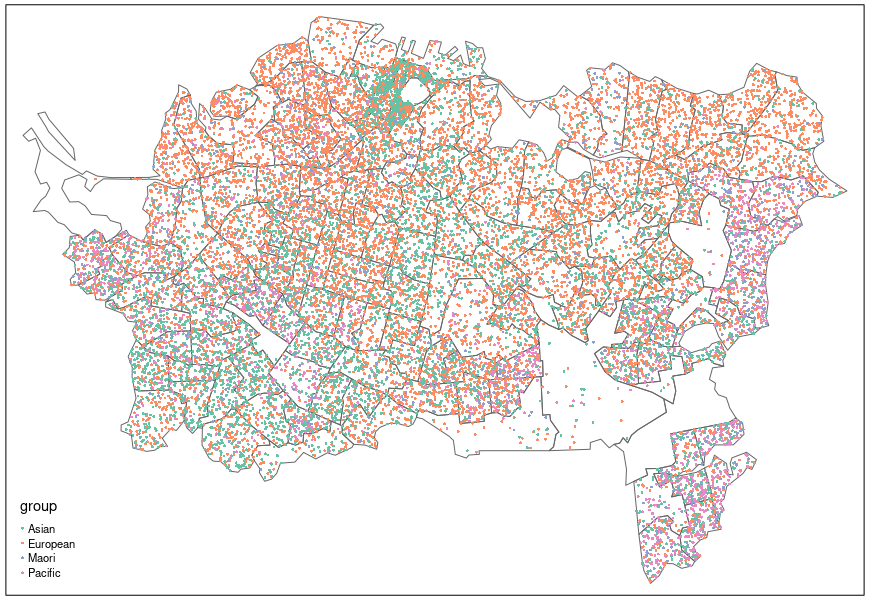
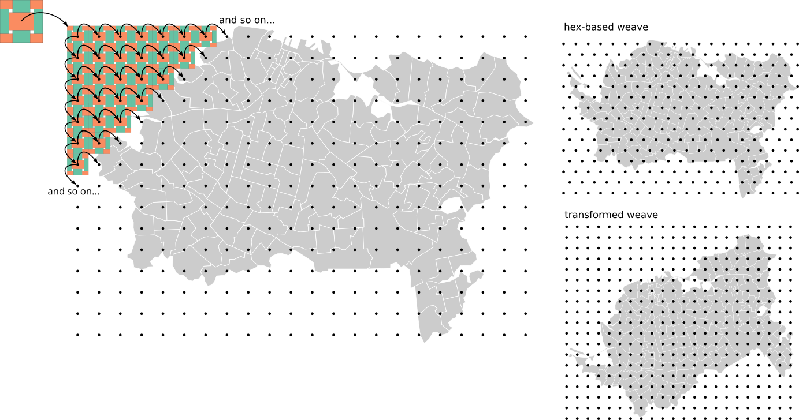

```{r message = FALSE, echo = FALSE, warning = FALSE, results = FALSE}
source("weaving-space-utils.R")
source("biaxial-weave-units.R")
source("triaxial-weave-units.R")
source("weave-map.R")

library(sf)        # vector spatial data
library(tmap)      # thematic maps
library(dplyr)     # data wrangling
library(anthromes)

library(ggplot2)   # plotting
library(tricolore) # trivariate choropleths
library(ggtern)    # trivariate legend

region <- st_read("data/vax-auckland-20211006.gpkg")
```

Weave patterns where each 'thread' or 'strand' represents a different attribute that can be independently symbolised in a map.

. _Socio-Economic Planning Sciences_.](images/chaves-et-al-2021-example.jpg)

This was done with SVG symbol fills in QGIS, and was (very!) fiddly to produce.


# Motivation and other approaches
Increasingly, we deal with highly multivariate data.

Many approaches can be used to visualise these spatially, but it's always challenging. We may resort to small multiple displays, where each attribute is presented as an individual (small) map. Or perhaps more often, we flip back and forward among many layers in a GIS.

Wouldn't it be nice to see multiple attributes together?! Perhaps to be able to identify patterns across more than one attribute in combination.

We're not the first to think this, so there are plenty of approaches already around...

## Small multiples
This is `sf`'s default plot output for a dataset.

```{r warning = FALSE, message = FALSE}
plot(region)
```


## Bivariate choropleths 
E.g., using [Jan Caha's QGIS plugin](https://jancaha.github.io/qgis-plugin-bivariate-renderer/) which implements an approach described by Joshua Stevens in [this post](https://www.joshuastevens.net/cartography/make-a-bivariate-choropleth-map/)




## Trivariate choropleths

Mixing three colours is hard, but e.g., the [`tricolore`](https://github.com/jschoeley/tricolore) package can do this...

```{r message = FALSE, warning = FALSE}
eth_mix <- tricolore::Tricolore(
  region, p1 = "pEuropean", p2 = "pMaori", p3 = "pAsian", breaks = 5
)
region$eth_mix_tri <- eth_mix$rgb

ggplot(region) + 
  geom_sf(aes(fill = eth_mix_tri)) + 
  scale_fill_identity() +
  annotation_custom(
    grob = ggplotGrob(eth_mix$key + labs(L = 'Pākehā', T = 'Māori', R = 'Asian')),
    xmin = 1.7465e6, xmax = 1.7535e6, ymin = 5.9075e6, ymax = 5.9125e6)
```


## Symbols over choropleths


## Multivariate symbols
The classic example is Dorling's Chernoff faces map of the UK 1987 election.

. Chichester, England: John Wiley & Sons.](images/dorling-chernoff-faces.jpg)

## Multi-element patterns
There are many variations on this idea, but perhaps the most common is a categorical dot map.

This example made using `tmap` and data preparation code from [James Smythe's cultureofinsight blog](https://www.cultureofinsight.com/post/multivariate-dot-density-maps-in-r-with-sf-ggplot2)




# A woven map

```{r warning = FALSE, message = FALSE, results = FALSE, eval = FALSE}
weave_unit <- get_biaxial_weave_unit(spacing = 200, type = "twill", n = 3, 
                                     aspect = 0.6, ids = "ab|cd", 
                                     crs = st_crs(region))
fabric <- weave_layer(weave_unit, region, angle = 30)
```

```{r echo = FALSE, message = FALSE, warning = FALSE, results = FALSE}
fabric <- st_read("data/fabric-raw.gpkg")
tmap_mode("view")
tmap_options(check.and.fix = TRUE)
```

Split the data by the `id` so that it is convenient to symbolise them separately.

```{r}
layers <- fabric %>% split(as.factor(fabric$id))
```

+ Each `id` value can be symbolised separately using symbolisation the data can support
+ We can also plot the region data as a choropleth if desired

```{r warning = FALSE, message = FALSE}
tm_shape(region, name = "Dose 2 uptake") +
  tm_fill(col = "dose2_uptake", palette = "inferno", style = "cont", 
          title = "Dose 2 per 1000", id = "SA22018_V1_00_NAME") +
  tm_shape(layers$a, name = "Pākehā") +
  tm_fill(col = "pEuropean", palette = "Greys", title = "% Pākehā", n = 3, 
          id = "SA22018_V1_00_NAME", popup.vars = c("pEuropean")) +
  tm_shape(layers$b, name = "Māori") +
  tm_fill(col = "pMaori", palette = "Reds", title = "% Māori", n = 3, 
          id = "SA22018_V1_00_NAME", popup.vars = c("pMaori")) +
  tm_shape(layers$c, name = "Pasifika") +
  tm_fill(col = "pPacific", palette = "Purples", title = "% Pasifika", n = 3, 
          id = "SA22018_V1_00_NAME", popup.vars = c("pPacific")) +
  tm_shape(layers$d, name = "Asian") +
  tm_fill(col = "pAsian", palette = "Greens", title = "% Asian", n = 3, 
          id = "SA22018_V1_00_NAME", popup.vars = c("pAsian"))
```

[Online full screen version](example-map-1.html)


# Implementing woven maps

+ Regular rectangular or hex grids of points generated by geospatial tools



What repeatable units can tile across such grids to give the appearance of a woven pattern? 

Turns out this is of interest to mathematicians (Grünbaum and Shephard 1985, 1986), who call such tileable elements the _fundamental blocks_ of _isonemal fabrics_

Anyway... we have proof-of-concept _R_ tools to make weave patterns:

1. [Make a weave unit](#weave-units)
2. [Tile the map area with the weave unit](#weave-a-map)
3. [Export to a multi-layer GPKG](#write-the-weave-layers)
4. Symbolise the weave elements as desired in _any_ tool


# Weave units (or fundamental blocks)
## Biaxial weaves
### Plain weaves
Traditional weave patterns with threads in two directions, the warp and the weft. We generate these using matrix multiplication (cf. Glassner 2002) 

Simplest is a plain weave

```{r warning = FALSE}
rect11_unit <-   ## plain weave example
  get_biaxial_weave_unit(spacing = 300, type = "plain",
                    ids = "a|b", crs = st_crs(region))
rect11_unit$primitive %>% plot(border = NA, main = "Plain weave unit")
```

This could be useful if clearly distinct palettes were used in the warp and weft elements. More useful is if we change the aspect to the warp and weft elements so we can distinguish directions:

```{r warning = FALSE}
rect11_unit <-   ## plain weave example
  get_biaxial_weave_unit(spacing = 300, aspect = 0.8,
                    ids = "a|b", crs = st_crs(region))
rect11_unit$primitive %>% plot(border = NA, main = "Plain weave unit, with directions")
```

### More threads, more colours
This is highly customisable:

```{r warning = FALSE}
rect32_unit <-
  get_biaxial_weave_unit(spacing = 300, aspect = sqrt(0.5), 
                    ids = "abc|de", crs = st_crs(region))
rect32_unit$primitive %>% plot(border = NA, main = "Plain weave, 3 warp and 2 weft colours")
```

### Missing threads
We can even leave gaps or duplicate threads

```{r warning = FALSE}
rect34_unit <-   ## plain weave example
  get_biaxial_weave_unit(spacing = 150, aspect = 0.8,
                    ids = "ab-|cc-d", crs = st_crs(region))
rect34_unit$primitive %>% plot(border = NA, main = "Complex plain weave with missing strands")
```

### Twill weaves and basket weaves

```{r warning = FALSE}
twill_unit <- 
  get_biaxial_weave_unit(spacing = 150, type = "twill", n = c(2, 2), 
                         aspect = 0.7, ids = "a|b", crs = st_crs(region))
twill_unit$primitive %>% plot(border = NA, main = "2 over 2 under twill weave")
```

```{r warning = FALSE}
basket_unit <- 
  get_biaxial_weave_unit(spacing = 150, type = "basket", n = 2, 
                         aspect = 0.7, ids = "a|b", crs = st_crs(region))
basket_unit$primitive %>% plot(border = NA, main = "2 over 2 under basket weave")
```

### Other weaves
We can generate any biaxial weavable pattern, even crazy ones!

```{r warning = FALSE}
this_unit <- 
  get_biaxial_weave_unit(spacing = 37.5, type = "this", ids = ids,
                        crs = st_crs(region))
this_unit$primitive %>% plot(border = NA, main = "Pattern from Glassner 2002")
```


## Triaxial weave units
### Hexagonal
We can also make weaves with threads running in 3 directions. This example is based on a hexagonal tileable unit, and can also allow for more than one thread in each direction

```{r warning = FALSE}
hex_unit <- ## hex example
  get_triaxial_weave_unit(spacing = 600, margin = 2,
                          ids = "a|bc|def", type = "hex", crs = st_crs(region))
hex_unit$tile %>% plot(col = "white", border = "black", 
                       main = "Hex-based triangular weave")
hex_unit$primitive %>% plot(border = NA, add = TRUE)
```

A cube is another option, although this produces some odd 3D effects when tiled

```{r warning = FALSE}
cube_unit <-
  get_triaxial_weave_unit(spacing = 600, ids = "ab|cd|ef", margin = 2, 
                          type = "cube", crs = st_crs(region))
cube_unit$primitive %>% plot(border = NA, 
                             main = "Mad weave (so called) with two colours in each direction")
```

<!-- ### Diamond -->
<!-- An alternative way to produce a triangular weave is with a diamond repeating unit with angles 60&deg; and 120&deg; -->

<!-- ```{r warning = FALSE} -->
<!-- diamond_unit <-   ## diamond example -->
<!--   get_triaxial_weave_unit(spacing = 600, margin = 2, -->
<!--                           ids = "a|b|c", type = "diamond", crs = st_crs(region)) -->
<!-- diamond_unit$tile %>% plot(col = NA, border = "black",  -->
<!--                            main = "Triangular weave with a diamond fundamental block") -->
<!-- diamond_unit$primitive %>% plot(border = NA, add = TRUE) -->
<!-- ``` -->


# Weave a map
As another example here are some data from Ellis et al. 2021, which aim to show change over 1000s of years in human-affected landcover globally. 

```{r warning = FALSE, message = FALSE, results = FALSE}
anthromes <- st_read("data/nz-anthromes-dgg.gpkg")
tmap_mode("plot")
tm_shape(anthromes) + 
  tm_fill(col = paste("class", seq(2000, 1800, -100), sep = ""), 
          palette = anthrome_colors(), title = "Anthrome") +
  tm_layout(panel.labels = c("2000", "1900", "1800"), 
            legend.outside = TRUE)
```

We make a weave unit and tile it so we can put the three snapshots in a single map.

```{r message = FALSE, warning = FALSE, results = FALSE, eval = FALSE}
tri_unit <- get_triaxial_weave_unit(spacing = 8000, ids = "a|b|c", type = "hex", 
                                    crs = st_crs(anthromes))
fabric2 <- weave_layer(tri_unit, anthromes, angle = 15)
```

Some tidying up needed for the web map hover labelling

```{r message = FALSE, warning = FALSE, results = FALSE}
fabric2 <- st_read("data/fabric2-raw.gpkg") %>%
  mutate(label = if_else(id == "a", 
                         paste("1800", class1800),               # make labels that include
                         ifelse(id == "b",                       # year and anthrome class
                                paste("2000", class2000), 
                                paste("1900", class1900)))) %>% 
  select(21, 1:19)                                               # and put them in 1st column
layers2 <- fabric2 %>% split(as.factor(fabric2$id))

tmap_mode("view")
```

```{r warning = FALSE, message = FALSE}
tm_shape(layers2$a, name = "1800") +
  tm_fill(col = "class1800", palette = anthrome_colors(), legend.show = FALSE) +
  tm_shape(layers2$c, name = "1900") +
  tm_fill(col = "class1900", palette = anthrome_colors(), legend.show = FALSE) +
  tm_shape(layers2$b, name = "2000") +
  tm_fill(col = "class2000", palette = anthrome_colors(), title = "Anthrome")
```

[Online full screen version](example-map-3.html) and an [alternate map using the cube weave](example-map-2.html)


# Write the weave layers
We can save out to a multi-layer GPKG for use in any tool

```{r eval = FALSE}
write_weave_layers(fabric, region, "data/fabric.gpkg")
write_weave_layers(fabric2, anthromes, "data/fabric2.gpkg")
```


# Further work
There is lots to do (at least potentially!)

+ Clarify the API for the tools to make their usage clearer
+ Figure out how to make legends...
+ Develop guidelines for what works (and what doesn't)
+ Figure out how colour work in this setting (how many, what combinations?)
+ Explore what symbolisations work (continuous, classified, categorical?)
+ Understand better how orientation operates
+ Consider the use of 'gaps' in a weave pattern
+ Ultimately an exploration of pattern and texture as visual variables


# Acknowledgments

+ Thanks to co-conspirator [Luke Bergmann (UBC)](https://geog.ubc.ca/profile/luke-bergmann/)
+ You'll find code at [github.com/DOSull/weaving-space](https://github.com/DOSull/weaving-space)


## References
Ellis EC, N Gauthier, K Klein Goldewijk, R Bliege Bird, N Boivin, S Díaz, DQ Fuller, JL Gill, JO Kaplan, N Kingston, H Locke, CNH McMichael, D Ranco, TC Rick, MR Shaw, L Stephens, J-C Svenning and JEM Watson. 2021. [People have shaped most of terrestrial nature for at least 12,000 years](https://doi.org/10.1073/pnas.2023483118). _Proceedings of the National Academy of Sciences_ **118**(17):e2023483118.

Gauthier N, E Ellis and K Klein Goldewijk. 2021. [Anthromes 12K DGG (V1) Full Dataset](https://dataverse.harvard.edu/citation?persistentId=doi:10.7910/DVN/E3H3AK). (last accessed 10 November 2021).

Glassner A. 2002. [_Digital weaving 1_](https://dx.doi.org/10.1109/MCG.2002.1046635). IEEE Computer Graphics and Applications **22**(6):108–118.

Glassner A. 2003a. [_Digital weaving 2_](https://dx.doi.org/10.1109/MCG.2003.1159616). IEEE Computer Graphics and Applications **23**(1):77–90.

Glassner A. 2003b. [_Digital weaving 3_](https://dx.doi.org/10.1109/MCG.2003.1185583). IEEE Computer Graphics and Applications **23**(2):80–83.

Griswold R. 2006 (unpublished manuscript). [Mathematical and Computational Topics in Weaving](https://www2.cs.arizona.edu/patterns/weaving/webdocs/mo/Griswold-MO.pdf) (last accessed 29 October 2021).

Grünbaum B and GC Shephard. 1985. [_A catologue of isonemal fabrics_](https://dx.doi.org/10.1111/j.1749-6632.1985.tb14560.x). _Annals of the New York Academy of Sciences_ **440**(1 Discrete Geom):279–298.

Grünbaum B and GC Shephard. 1986. [_An extension to the catalogue of isonemal fabrics_](https://dx.doi.org/10.1016/0012-365X(86)90010-5). Discrete Mathematics **60**:155–192.

And this video by Lea Albaugh provided a nice way in to the topic for us: ["It's Just Matrix Multiplication": Notation for Weaving](https://www.youtube.com/watch?v=oMOSiag3dxg), presented at the Strange Loop conference, St Louis, 27-28 Sept, 2018. 


## Questions?
