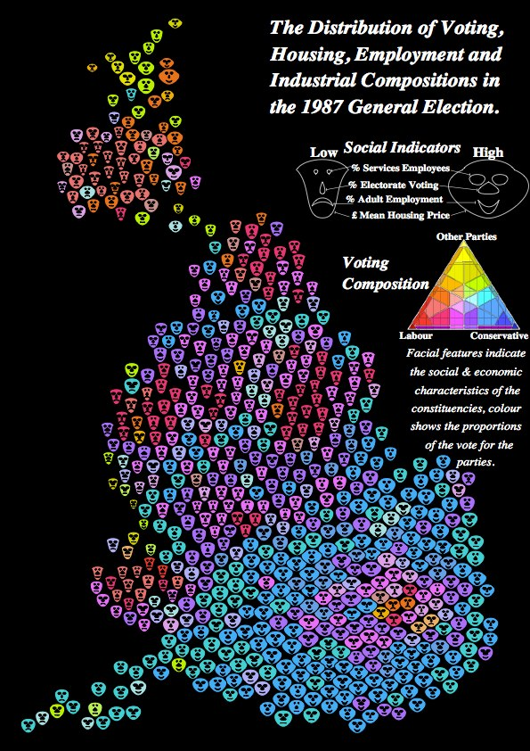
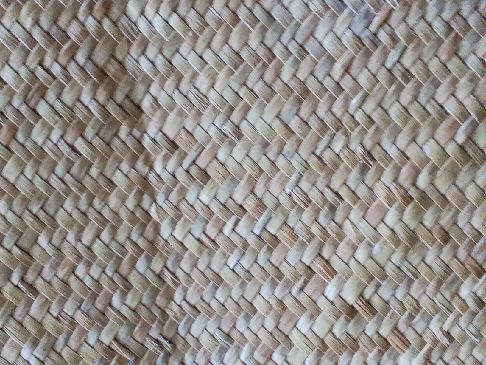

<style>
.menu ul li {
  /* padding of the menu items in material is stupidly large */
  padding: 0px 0px 0px 0px;
}
</style>

# Preliminaries
We've been working in _R_ for the 'one-stop-shop' mix of coding, handling spatial data, and visualization

It's work in progress, so these aren't slides, more an annotated _RMarkdown_ notebook

This section gives a sense of the requirements

## Source code
Our code lives in these files

```{r message = FALSE}
source("weaving-space-utils.R")
source("biaxial-weave-units.R")
source("triaxial-weave-units.R")
source("weave-map.R")
```

## Libraries
And here, for reference are the packages we've used (so far!)

```{r message = FALSE}
library(sf)        # vector spatial data
library(wk)        # WKT features and affine transforms
library(tmap)      # thematic maps
library(dplyr)     # data wrangling
library(pracma)    # more matrix stuff
```

And some more used to make example maps of other approaches

```{r message = FALSE}
library(ggplot2)   # plotting
library(tricolore) # trivariate choropleths
library(ggtern)    # trivariate legend
```

## Some example data to mess with

```{r message = FALSE, warning = FALSE}
region <- st_read("data/vax-auckland-20211006.gpkg")
```

Note that for our method we need this in part so we can match its CRS


# Motivation
Increasingly, we deal with highly multivariate data. 

Many approaches can be used to visualise these in spatial contexts, but it's always challenging. Often we resort to small multiple displays, where each attribute is presented as an individual (small) map. Or perhaps more often, we finding ourselves flipping back and forward among many layers in a GIS or other tool.

Wouldn't it be nice to see multiple attributes together?! Perhaps to be able to identify patterns across more than one attribute in combination.

We're not the first to think this, so there are plenty of approaches already around...

## Small multiples
This is `sf`'s default plot output for a dataset

```{r warning = FALSE, message = FALSE}
plot(region)
```


## Bivariate choropleths 
A crude approach uses alpha values for each attribute, e.g., in `tmap`

```{r}
tm_shape(region) + 
  tm_polygons(col = "dose2_uptake", palette = "-Reds", alpha = 0.65, 
              title = "Dose 2 per thousand ") + 
  tm_shape(region) + 
  tm_polygons(col = "pAsian", palette = "Blues", alpha = 0.35,
              title = "% Asian") +
  tm_layout(legend.outside = TRUE)
```

Or, use something like [Jan Caha's QGIS plugin](https://jancaha.github.io/qgis-plugin-bivariate-renderer/) which implements the approach described by Joshua Stevens in [this post](https://www.joshuastevens.net/cartography/make-a-bivariate-choropleth-map/)


## Trivariate choropleths

Mixing three colours is hard, but e.g., the [`tricolore` package](https://github.com/jschoeley/tricolore) can do this...

```{r message = FALSE, warning = FALSE}
eth_mix <- tricolore::Tricolore(
  region, p1 = "pEuropean", p2 = "pMaori", p3 = "pAsian", breaks = 5
)
region$eth_mix_tri <- eth_mix$rgb

ggplot(region) + 
  geom_sf(aes(fill = eth_mix_tri)) + 
  scale_fill_identity() +
  annotation_custom(
    grob = ggplotGrob(eth_mix$key + labs(L = 'Pākehā', T = 'Māori', R = 'Asian')),
    xmin = 1.7465e6, xmax = 1.7535e6, ymin = 5.9075e6, ymax = 5.9125e6)
```

## Symbols over choropleths
A simple example


## Multivariate symbols
The classic example here is Dorling's Chernoff faces map of the UK 1987 election




## Multi-element patterns
There are many variations on this idea, but perhaps the most common is a categorical dot map

This example made using `tmap` and data preparation code from [James Smythe's cultureofinsight blog](https://www.cultureofinsight.com/post/multivariate-dot-density-maps-in-r-with-sf-ggplot2)


# Our idea
A weave pattern where each 'thread' or 'ribbon' (the warp and weft) represents a different attribute that can be independently symbolised

. _Socio-Economic Planning Sciences_.
](images/chaves-et-al-2021-example.jpg)

This was done with SVG symbol fills in QGIS, and was (very!) fiddly to produce

But it got us thinking about the wider possibilities...



## Preliminary implementation

+ Regular rectangular or hex grids of points generated by geospatial tools


+ What repeatable units can tile across such grids to give the appearance of a woven pattern? 

We have proof-of-concept _R_ tools to make weave patterns:

+ [Make a weave unit](#weave-units)
+ [Tile the map area with the weave unit](#weave-a-map)
+ [Symbolise the resulting weave elements as desired](#weave-a-map)
+ [Export to a multi-layer GPKG](#write-the-weave-layers)

# Weave units
## Biaxial weaves
### Plain weaves
Traditional weave patterns with threads in two directions, the warp and the weft. These are all generated drawing on the matrix multiplication underpinnings of weaving! 

The simplest case is a plain weave.

```{r warning = FALSE}
rect11_unit <-   ## plain weave example
  get_biaxial_weave_unit(spacing = 300, type = "plain",
                    ids = "a|b", crs = st_crs(region))
rect11_unit$primitive %>% plot(lwd = 0.01)
```

This could be useful if clearly distinct palettes were used in the warp and weft elements. More useful is if we change the aspect to the warp and weft elements so we can distinguish directions.

```{r warning = FALSE}
rect11_unit <-   ## plain weave example
  get_biaxial_weave_unit(spacing = 300, aspect = 0.8,
                    ids = "ab|cd", crs = st_crs(region))
rect11_unit$primitive %>% plot(lwd = 0.01)
```

### More threads
This is highly customisable

```{r warning = FALSE}
rect32_unit <-
  get_biaxial_weave_unit(spacing = 150, aspect = sqrt(0.5), 
                    ids = "abc|de", crs = st_crs(region))
rect32_unit$primitive %>% plot(lwd = 0.01)
```

### Missing threads
We can even leave gaps or duplicate threads

```{r warning = FALSE}
rect34_unit <-   ## plain weave example
  get_biaxial_weave_unit(spacing = 300, aspect = 0.8,
                    ids = "ab-|cc-d", crs = st_crs(region))
rect34_unit$primitive %>% plot(lwd = 0.01)
```

### Twill weaves and basket weaves
There are near infinite possibilities here...

```{r warning = FALSE}
twill_unit <- 
  get_biaxial_weave_unit(spacing = 200, type = "twill", n = 2, 
                         aspect = 0.6, ids = "ab|cd", crs = st_crs(region))
twill_unit$primitive %>% plot(lwd = 0.01)
```

```{r warning = FALSE}
basket_unit <- 
  get_biaxial_weave_unit(spacing = 200, type = "basket", n = 2, 
                         aspect = 0.8, ids = "ab|cd", crs = st_crs(region))
basket_unit$primitive %>% plot(lwd = 0.01)
```

### Other weaves
And here is another example (this makes use of the capability to generate any weavable repeat pattern, but the pattern is hardcoded for now...)

```{r warning = FALSE}
this_unit <- 
  get_biaxial_weave_unit(spacing = 200, type = "this", aspect = 0.8,
                        ids = "a|b", crs = st_crs(region))
this_unit$primitive %>% plot(lwd = 0.01)
```

## Triaxial weaves
### Hexagonal
We can also make weaves with threads running in 3 directions. This example is based on a hexagonal tileable unit, and can allow for more than one thread in each direction

```{r warning = FALSE}
hex_unit <- ## hex example
  get_triaxial_weave_unit(spacing = 600, margin = 2,
                          ids = "a|b|cd", type = "hex", crs = st_crs(region))
hex_unit$primitive %>% plot(lwd = 0.01)
```

A cube is another option, although this produces some odd 3D effects when tiled

```{r warning = FALSE}
cube_unit <-
  get_triaxial_weave_unit(spacing = 600, ids = "ab|cd|ef", margin = 5, 
                          type = "cube", crs = st_crs(region))
cube_unit$primitive %>% plot(lwd = 0.01)
```

### Diamond
An alternative way to produce a triangular weave is with a diamond repeating unit with angles 60&deg; and 120&deg;

```{r warning = FALSE}
diamond_unit <-   ## diamond example
  get_triaxial_weave_unit(spacing = 600, margin = 10,
                          ids = "a|b|c", type = "diamond", crs = st_crs(region))
diamond_unit$primitive %>% plot(lwd = 0.01)
```

### Tiling diamond units and transforming weaves
Tiling the diamond unit is slightly more involved than rectangular or hexagonal units:

+ transform to a rectangle (applying the same transformation to the map)
+ perform the tiling (rectangularly)
+ invert the transformation

We allow for any of the weave unit 'tiles' to be transformed in this way. 

For example we can transform the region to tile like this

```{r}
region[, 2] %>% sf_diamond_to_square() %>% tm_shape() + tm_polygons()
```

then tile it with any weave unit, and transform back to the original map coordinates. This allows us to (say) take the twill tile above and apply it in this form:

```{r}
twill_unit$primitive %>% sf_square_to_diamond() %>% plot(lwd = 0.01)
```


# Weave a map
Now 'weave' the map with one of the weave unit tiles applied to the region

We can also optionally specify a rotation and an affine transformation

```{r warning = FALSE}
cloth <- weave_layer(twill_unit, region, angle = 30)
# cloth <- weave_layer(weave_unit, region,
#                      transform = affine_abcd(1, 0, 0.5, 1))
```

## Make the map
Do this in `tmap` "view" mode for a zoomable web map.

```{r warning = FALSE, message = FALSE}
tmap_mode("view")
```

```{r echo = FALSE}
tmap_options(check.and.fix = TRUE)
```

Split the data by the `id` so that it is convenient to symbolise them separately

```{r}
layers <- cloth %>% split(as.factor(cloth$id))
```

+ Each `id` value can be symbolised separately using symbolisation the data can support
+ We can also plot the region data as a choropleth if desired

```{r warning = FALSE, message = FALSE}
tm_shape(region, name = "Dose 2 uptake") +
  tm_fill(col = "dose2_uptake", palette = "inferno", style = "cont", title = "Dose 2 per 1000") +
  tm_shape(layers$a, name = "Pākehā") +
  tm_fill(col = "pEuropean", palette = "Greys", title = "% Pākehā", n = 3) +
  tm_shape(layers$b, name = "Māori") +
  tm_fill(col = "pMaori", palette = "Reds", title = "% Māori", n = 3) +
  tm_shape(layers$c, name = "Pasifika") +
  tm_fill(col = "pPacific", palette = "Purples", title = "% Pasifika", n = 3) +
  tm_shape(layers$d, name = "Asian") +
  tm_fill(col = "pAsian", palette = "Greens", title = "% Asian", n = 3) +
  tm_basemap(server = "CartoDB.VoyagerNoLabels")
```

[Online full screen version](https://dosull.github.io/weaving-space/example-map-1.html)

## Another example
```{r echo = FALSE, message = FALSE, warning = FALSE, results = FALSE}
welly.votes <- st_read("data/welly-sa2-votes-2020.gpkg")
```

```{r echo = FALSE, message = FALSE, warning = FALSE}
weave_maps <- list()
spacings <- c(500, 1000, 1500)
for (i in 1:length(spacings)) {
  weave <- get_triaxial_weave_unit(spacing = spacings[i], type = "hex", crs = st_crs(welly.votes)) %>%
    weave_layer(welly.votes, angle = 15) 
  weave_maps[[i]] <- 
    tm_shape(dplyr::filter(weave, id == "a"), name = "Labour") +
    tm_fill(col = "Labour.Party", palette = "Reds", legend.show = FALSE, title = "Labour") +
    tm_shape(dplyr::filter(weave, id == "b"), name = "National") +
    tm_fill(col = "National.Party", palette = "Blues", legend.show = FALSE, title = "National") +
    tm_shape(dplyr::filter(weave, id == "c"), name = "Green") +
    tm_fill(col = "Green.Party", palette = "Greens", legend.show = FALSE, title = "Green") +
    tm_shape(welly.votes, name = "SA2s") +
    tm_borders()
}
tmap_arrange(weave_maps)
```


# Write the weave layers
We can also save out to a multi-layer GPKG for use in any tool

```{r eval = FALSE}
write_weave_layers(cloth, region, "data/cloth.gpkg")
```

# Further work
There is lots to do (at least potentially!)

+ Clarify the API for the tools to make their usage clearer
+ Figure out how to make legends...
+ Develop guidelines for what works
+ How does colour work in this setting (how many, what combinations?)
+ Explore what symbolisations work (continuous, classified, categorical?)
+ Understand better how orientation operates

# Acknowledgments

+ Thanks to co-conspirator Luke Bergmann (UBC)
+ You'll find code at [github.com/DOSull/weaving-space](https://github.com/DOSull/weaving-space)

## Questions?
