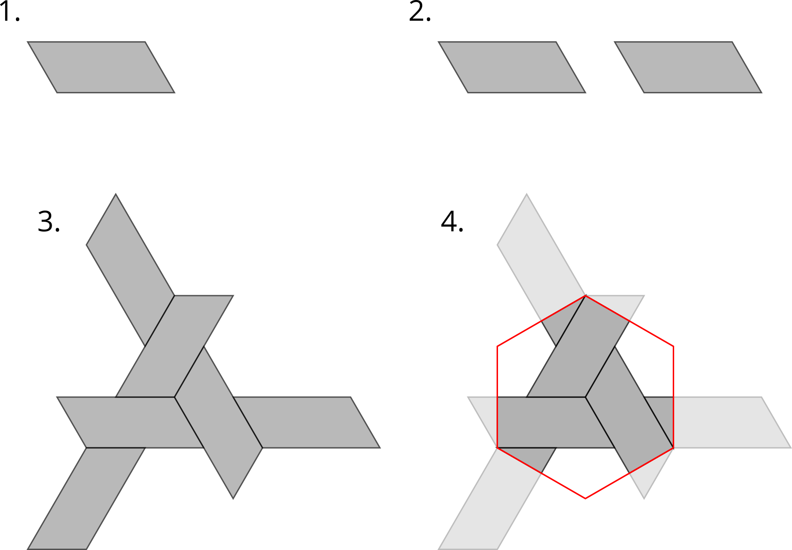

# Introduction
This document aims to explain how triaxial weaves have been implemented in [`triaxial_weave_units.R`](triaxial-weave-units.R) including references to source literature, example code snippets etc. References to code are [accurate at time of writing](https://github.com/DOSull/weaving-space/commit/735c6a828f682c52afd0fddf3570ce5fa4badaf3), but the code is subject (even likely) to change.

```{r warning = FALSE, message = FALSE, results = FALSE}
source("triaxial-weave-units.R")
source("weaving-space-utils.R") # for parsing strand specification strings
```

# Interface to the triaxial weave functions
The main external function is `get_triaxial_weave_unit()` which returns a `list` with elements, describing the _fundamental block_ (term from somewhere in Grünbaum and Shephard's work) of the weave. The elements in the `list` are

- `primitive` a `sf` dataset of polygons, which should be tileable to produce a weave pattern
- `transform` a `wk` affine transform matrix required to tile the `primitive` - this will always be the identity matrix for biaxial units
- `strands` a vector of the unique strand id labels in the `sf` - NOT USED (redundant)
- `tile` a `sf` polygon of the tile shape - perhaps useful
- `type` a string of the type of this unit

For example

```{r warning = FALSE}
unit <- get_triaxial_weave_unit(spacing = 100, aspect = 0.75, margin = 0, 
                               type = "hex", strands = "abc|de", crs = 2193)
unit
```

Most commonly, this will be plotted to inspect the result

```{r}
unit$primitive %>% plot(border = NA)
```

**[More to follow on the function options - perhaps not in this document...]**

# Internal operation
The steps required to generate the fundamental block or _weave unit_ are 

1. Determine the type of unit requested -- one of `"hex"`, `"cube"` or `"diamond"`
2. Build the unit from polygons in a bespoke manner

The creation of each of these different weave patterns is effectively bespoke, in functions `getHexPrimitiveCell()`, `getCubePrimitiveCell()` and `getDiamondPrimitiveCell()`.

In each case, the steps are similar and set out below for the `"hex"` case

1. Create a base polygon
2. Create translated copies of the base polygon
3. Create rotated copies of all the polygons
4. Form an appropriate tile unit and cookie-cut the polygons

This process is shown below for the `"hex"` style



One additional wrinkle is that the base polygon may actually consist of several polygons arranged in 'slices' along the length of the polygons. Note that this is the only support the triaxial weaves provide for multiple strands along each axis, meaning

(i) The full diversity of possible triaxial weaves is not supported
(ii) The strand specification for triaxial weaves does not support 'bracketing'
 together of strand IDs, and will instead produce additional strands with names such as "(" and ")"

There is not much to say further about the triaxial patterns in this implementation. The relative inflexibility of the approach has led to [attempts to develop a matrix approach to triaxial weaves](towards-triaxial-weaves-using-matrices.html), similar to the [biaxial approach](notes-on-biaxial-weave-implementation.html).
