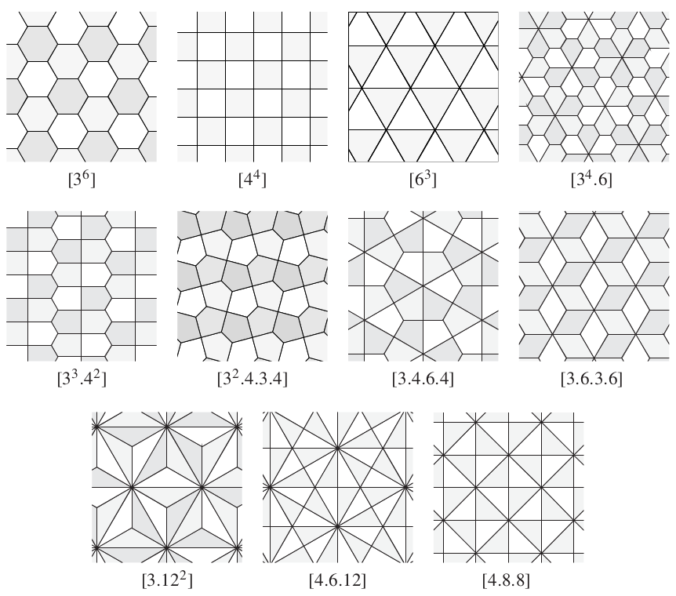
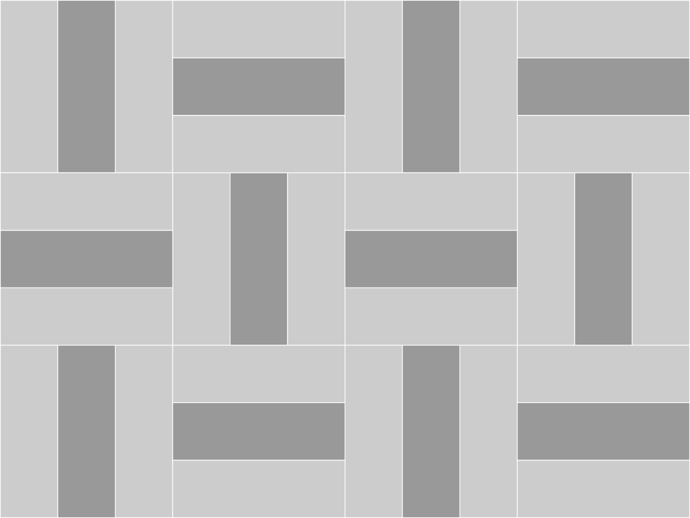
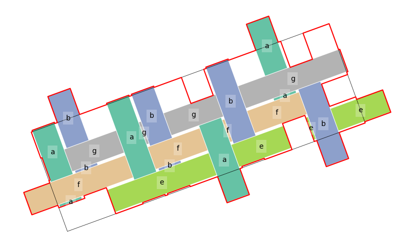

# The state of the tiling universe
Setting aside the small matter of [the discovery in 2023 of an aperiodic monotile](https://arxiv.org/abs/2305.17743), here are some notes (in lieu of a long slack post) on where the *weavingspace* project is at. Most links in the below are to items in the [glossary](#glossary).

## Notes on the code
**2 February 2024**

The latest round of coding has added a lot, particularly with respect to correctly implementing the labelling of distinct [equivalence classes](#equivalence-class) of [tiling](#tiling) [vertices](#vertex), tiling [edges](#edge), and [tiles](#tiling) themselves. 

In our case [translations](#translation) are baked in&mdash;we know these exist, because we put them there. Finding [rotation](#rotation) and [reflection](#reflection) [symmetries](#symmetry) which preserve the tiling is necessary for detecting [equivalence classes](#equivalence-class), which in turn is required to [label](#labelling) edges and vertices in order to support principled modification of tiles so as to maintain tileability.

Getting to this point has revealed some weaknesses in the Rube Goldberg / Heath Robinson machinery along with other desiderata.

In no particular order:

### Modifying tiles
The whole point of venturing into [topology](#topology) was to enable principled modification of tiles&mdash;typically making them more ‘elaborate’ in an Escher-like way. For example, [this tiling](example-tiles-wobbly-escherian.ipynb) is derived (by hand) by putting a sinusoidal curve along each edge of square tiling, and indicates the surprising variety in tilings that might be enabled by allowing this possibility.

At the moment the only modification we’ve got is to [‘zig-zag’ an edge](https://dosull.github.io/weaving-space/doc/weavingspace/topology.html#Topology.transform_edges). More transforms of edges/vertices remain to be considered.

### Corners and vertices
The tile [corner](#corner) / tiling [vertex](#vertex) distinction is not carefully observed in the code. The [equivalence class](#equivalence-class) implementation should make this easier to do. For example it should be easy enough now to *not* label corners, as the logic of tiling symmetry implies.

### The [`symmetry` code](doc/weavingspace/symmetry.html)
The symmetry code needs to be revisited: it works, but the 'clever' quick fix that reuses code for finding the symmetries of a single polygon to identify the [transformations](#transformation) between two distinct tiles is shaky. In particular when presented with a polygon and its mirror image, if the polygon has no rotational symmetries the function returns a `None` result, suggesting the two polygons are unrelated. This has possible implications for the reliability of correctly labelling some tilings. While the 12-slices of a hexagon (Laves 4.6.12) tiling is correctly labelled, the two orientations of triangle are incorrectly assigned to different ['groups'](#shape-group) during [`Topology`](doc/weavingspace/topology.html) construction.

Also in relation to symmetries it would be nice on a diagram like that below to show the symmetry involved in each transformation. This relates to how tiling symmetries are implemented as a class. Although they are currently a class, there's not a lot there... This is also related to the previous point about transformations between two distinct polygons and would be a secondary goal of addressing the symmetry code issues.

### Graphs and `networkx`
Late in the process of implementing equivalence classes, I (with some reluctance) imported `networkx` to resolve a gnarly problem of extracting the 'exclusive supersets' of a list of sets. And of course... 5 lines of graph code specifically the [`connected_components`](https://networkx.org/documentation/stable/reference/algorithms/generated/networkx.algorithms.components.connected_components.html#networkx.algorithms.components.connected_components) method and the problem disappeared.

On reflection there are a number of places in the equivalence class code, which are effectively tackling the same problem in a more roundabout way, and it might pay to revisit them with that tool at hand. It could perhaps make the code a lot easy to follow (and perhaps quicker too).

### Labelling tiles
The first round of attempts to label vertices and edges was 'tile-centric' and revolved around labelling tile [corners](#corner) and [sides](#side) under the tile's symmetries. It remains to be seen if this code still has a role to play.

### Integration
At the moment, the `Topology` code is almost entirely independent of the main codebase. A `Topology` object is constructed by supplying a `Tileable` instance, and the code makes extensive use of functions in the [`tiling_utils`](doc/weavingspace/tiling_utils.html) module, but no more than that. Whether a `Topology` should be embedded in a [`Tileable`](#tileable) by default, or whether one should be used to generate [dual tilings](#dual-tiling) or not is an open question \[the [dual generation code in `Topology`](https://dosull.github.io/weaving-space/doc/weavingspace/topology.html#Topology.generate_dual) is much more satisfying and (probably) robust than the [`tiling_utils` implementation](https://dosull.github.io/weaving-space/doc/weavingspace/tiling_utils.html#get_dual_tile_unit)\].

### The superfluity of tiles in `WeaveUnit` tilings
Because of how they are generated our weave based `Tileable` objects (`WeaveUnit`s) often contain more tiles than strictly required. In many biaxial tilings there are two times the required number. In the triaxial case it is often much worse than that with as many as 9 times more tiles than required. This causes the `Topology` code to choke and fail. Needs investigation...

## Glossary
An attempt to define terms and how they relate to aspects of the code.

### Mathematical tiling terms
#### Corner
A point on the perimeter of a tile polygon where the perimeter changes direction. A polygon corner in the usual sense. Distinct from a tiling [vertex](#vertex). Corners are properties of individual tiles, not of the tiling.
#### Dual tiling
The tiling formed from an existing tiling by placing a [vertex](#vertex) at each [tile](#tile) and joining them by [edges](#edge) between any two tiles that share an edge in the original tiling. Tiles become vertices and vertices become tiles. The relation is reciprocal and essentially topological not geometric, since the placement of a vertex in a tile is ill-defined. An important dual relation is that between the [Archimedean](https://en.wikipedia.org/wiki/Euclidean_tilings_by_convex_regular_polygons#Archimedean,_uniform_or_semiregular_tilings) and the [Laves](https://en.wikipedia.org/wiki/List_of_Euclidean_uniform_tilings#Laves_tilings) tilings.

#### Edge
The line along which two [tiles](#tile) in a tiling meet. An edge has a [vertex](#vertex) at each end and any number of [corners](#corner) along its length. Edges are a property of a tiling, not of individual tiles.
#### Element
Collective term for [tiles](#tile), [edges](#edge) and [vertices](#vertex).
#### Equivalence class
A group of [elements](#element) ([tiles](#tile), [vertices](#vertex), or [edges](#edge)) that map onto one another under the [symmetries](#symmetry) of the [tiling](#tiling). This concept is a subtle one. The tiling below has _two_ equivalence classes of tile, since there is no transformation that maps central tiles on to outer tiles while also mapping all tiles onto a tile. Those central tiles only ever map onto other central tiles, hence they are in a different equivalence class than the outer tiles, which form a second equivalence class. A tiling with one equivalence class is termed _isohedral_, and 2-hedral, _n_-hedral etc. are terms that are also used. Similar notions apply to vertices and edges, where the terms are respectively _isogonality_ and _isotoxality_. The isohedral tilings of the plane have been thoroughly explored (for example it is proven that there are 81 types...).

#### Fundamental unit
A subset of a tiling which under two non-parallel [translations](#translation) can tile the plane. It is important to realise that the fundamental unit of a tiling is not uniquely defined. In a tiling with two orthogonal translation vectors, for example, any square region defined by those two vectors is a fundamental unit. In our implementation approximately equivalent to a [`Tileable`](#tileable).
#### Periodic tiling
A tiling with two non-parallel [translations](#translation) among its [symmetries](#symmetry).
#### Prototile
Any one of the tiles that constitute a tiling. A set of prototiles is said to 'admit' a tiling. In our implementation the term is applied to the geometric union of the polygons in a [`Tileable`](#tileable), which is closer to the [fundamental unit](#fundamental-unit). Refactoring to make things map better onto the literature is an option...
#### Reflection
The image of a geometric object under a reflection [transformation](#transformation) is its mirror image. A possible [symmetry](#symmetry) of a tile or tiling. Defined by a line of symmetry in which the reflection occurs. 
#### Rotation
A [transformation](#transformation) of the plane around a fixed point (the centre of rotation) by a given angle. One of the possible [symmetries](#symmetry) of a tile or tiling.
#### Side
A side of a polygon as commonly understood, connecting two of its [corners](#corner). Distinct from a tiling [edge](#edge). There is always a change in direction at a corner, but there may be many corners along a tiling edge. Tile [corners](#corner) and tiling [vertices](#vertex) are often coincident but a vertex is not always a corner (there might be no change in direction) and corner is not always a vertex (if it is along an edge, when it will be incident on only two tiles).
#### Symmetry
OMG. All of mathematics. But seriously... albeit briefly, in our context a symmetry is any [transformation](#transformation) of a tiling that maps its [elements](#element) back on to other elements. Tiles also have symmetries but the symmetries of a tiling and of its constituent tiles are not the same. For example in the example above of the Cairo tiling the tiles have only a single reflection symmetry (also symmetry of the tiling), but the tiling also has 90&deg; rotational symmetries.
#### Tile
A polygon that when arranged in a [tiling](#tiling) exhausts the plane. A polygon is formed by straight [sides](#side) connecting [corners](#corner).
#### Tiling
A covering of the plane with tiles. According to Grünbaum and Shephard 1987, page 16:
> "... a countable family of closed sets $\mathcal{T}=\{T_1,T_2,\ldots\}$ which covers the plane without gaps or overlaps. More explicitly, the union of the sets $T_1,T_2,\ldots$ (which are known as the *tiles* of $\mathcal{T}$) is to be the whole plane, and the interiors of the sets $T_i$ are to be pairwise disjoint"

So... closely related to a GIS coverage then...
#### Transformation
A one-to-one mapping of every point in the plane to another point in the plane. 
#### Translation
A [transformation](#transformation) in which every point in the plane is displaced by a defined vector, i.e. $(x,y)\rarr(x+\delta x,y+\delta y)$. In our case all tilings are [periodic](#periodic-tiling), meaning that they have two non-parallel transformation [symmetries](#symmetry). 
#### Vertex
Points in a tiling at which three or more [tiles](#tile) meet, which are therefore the end points of tiling [edges](#edge). Often but not always coincident with the [corners](#corner) of tiles. In particular tiling vertices may result from the tiling. For example in the 'cheese sandwich' tiling above, the tiling induces two vertices along the long sides of each rectangle.

### More implementation related
#### Labelling
A general term for the process of assigning tiles, vertices and edges to equivalence classes, which allows them to be labelled. Currently tiles don't get labelled, but since they are in equivalence classes it wouldn't be hard to do this.
#### `prototile`
A simple polygon associated with a `Tileable` object derived from either a rectangle or a hexagon.
#### Regularised prototile
This really only matters for weave based tilings where generation of the `Tileable` object produces 'fragments' that are parts of the tiles that lie outside the simple prototile rectangle of hexagon shape. Some nasty code attempts to assemble such fragment back into a more manageable set and the result jigaw puzzle shaped piece is the regularised prototile. Here's an example (the red outline below):

#### 'Shape group'
An early implementation of [labelling](#labelling) relied on labelling the corners and sides of tile polygons. Identifying the different shapes in a tiling was a key step in this process. There is still a `tile_groups` attribute of the `Topology` class as a result. More work on the [symmetry code](#the-symmetry-code) will probably make these assignments more reliable.
#### Tileable
The central object class in the code base. A `Tileable` instance has the following attributes that more or less loosely link to the [mathematical concepts](#mathematical-tiling-terms) above:
+ `tiles` a [geopandas.GeoDataFrame](https://geopandas.org/en/stable/docs/reference/api/geopandas.GeoDataFrame.html) of [shapely.geometry.Polygon](https://shapely.readthedocs.io/en/stable/reference/shapely.Polygon.html) objects, with associated `tile_id` (by default a single character string) identifying tiles that can be associated with different data attributes.
+ `prototile` also a `GeoDataFrame`, containing a single polygon shape which will be a rectangle or hexagon or simple modification (by stretching or skewing) of those, which indicates how the tiling can be constructed. Vectors joining opposite faces of the prototile form the `vectors` of the `Tileable` and model the translation symmetries of the tiling.
+ `regularised prototile` also a `GeoDataFrame` containing a single polygon. It is possible for the `prototile` to cut across tile polygons in the `Tileable`; the regularised prototile is a different tileable polygon containing only complete tiles.
+ `vectors` a set of tuples of x and y displacements by which the polygons in the `Tileable`'s `tiles` attribute are 'copied and pasted' across a map area. These are not a minimal set of translation vectors. For example, hexagonally based tilings have 6 vectors (3 each in two different directions) where a strict mathematical representation would require only 2 (the third is the difference between the other two).
#### Tile unit
A specialisation of the `Tileable` class that represents 'traditional' geometric tilings, constructed by geometry as implemented in the [`tiling_geometries` module](https://dosull.github.io/weaving-space/doc/weavingspace/tiling_geometries.html).
#### Topology
A class that attempts to represent the [elements](#element) in a tiling (i.e. tiles, vertices and edges) and the relations among them, in particular enabling [labelling](#labelling) by detecting the [equivalence classes](#equivalence-class) of the tiling.
#### Translation vector
An $(x, y)$ tuple displacement by which repetitions of the `Tileable.tiles` polygons are combined to yield  a tiling.
#### Weave unit
A specialisation of the `Tileable` class that represents tilings that can be produced by weaving. A particular feature of note is the `aspect` attribute which defines the width of 'strands' in the weave relative to their spacing, and may mean that the resulting tiling has 'holes' (and are hence not tilings [as defined by Grünbaum \& Shephard](#tiling)). Note that there is theory of _isonemal_ tilings which are precisely tilings that can be generated by weaving albeit without gaps (which in our implementation equates to `aspect = 1`).
