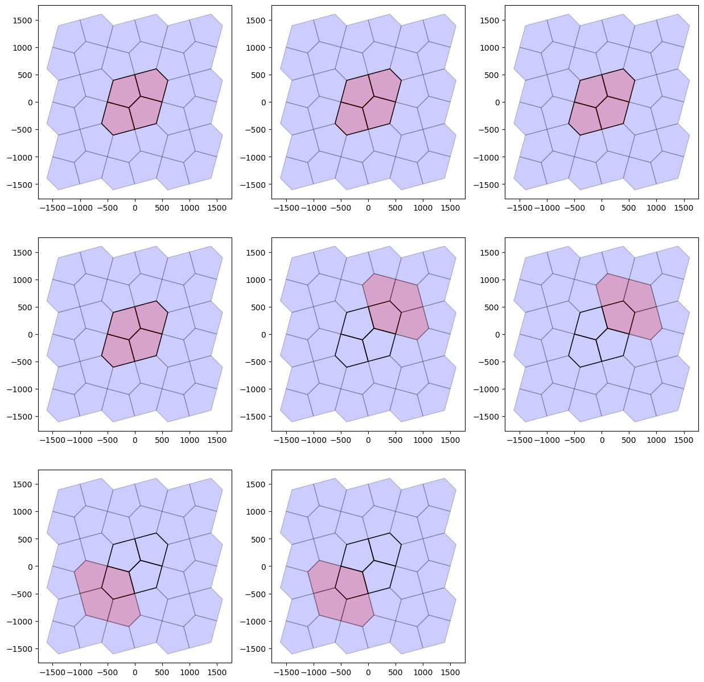

# The state of the tiling code
**2 February 2024**

Some notes (in lieu of a long slack post). Words in *italics* are defined in the [glossary](#glossary).

The latest round of coding has added a lot, particularly with respect to correctly implementing the labelling of distinct [equivalence classes](#equivalence-class) of [tiling](#tiling) [vertices](#vertex), tiling [edges](#edge), and [tiles](#tiling) themselves. 

In our case [translations](#translation) are baked in&mdash;we know these exist, because we put them there. Finding [rotation](#rotation) and [reflection](#reflection) [symmetries](#symmetry) which preserve the tiling is necessary for detecting [equivalence classes](#equivalence-class), which in turn is required to [label](#labelling) edges and vertices in order to support principled modification of tiles so as to maintain tileability.

Getting to this point has revealed some weaknesses in the Rube Goldberg / Heath Robinson machinery along with other desiderata.

In no particular order:

## Modifying tiles
The whole point of venturing into [topology](#topology) was to enable principled modification of tiles&mdash;typically making them more ‘elaborate’ in an Escher-like way. For example, [this tiling](example-tiles-wobbly-escherian.ipynb) is derived (by hand) by putting a sinusoidal curve along each edge of square tiling, and indicates the surprising variety in tilings that might be enabled by allowing this possibility.

At the moment the only modification we’ve got is to [‘zig-zag’ an edge](doc/weavingspace/topology.html#transform-edges). More transforms of edges/vertices remain to be considered.

## Corners and vertices
The tile [corner](#corner) / tiling [vertex](#vertex) distinction is not carefully observed in the code. The [equivalence class](#equivalence-class) implementation should make this easier to do. For example it should be easy enough now to *not* label corners, as the logic of tiling symmetry implies.

## The [`symmetry` code](doc/weavingspace/symmetry.html)
The symmetry code needs to be revisited: it works, but the 'clever' quick fix that reuses code for finding the symmetries of a single polygon to identify the [transformations](#transformation) between two distinct tiles is shaky. In particular when presented with a polygon and its mirror image, if the polygon has no rotational symmetries the function returns a `None` result, suggesting the two polygons are unrelated. This has possible implications for the reliability of correctly labelling some tilings. While the 12-slices of a hexagon (Laves 4.6.12) tiling is correctly labelled, the two orientations of triangle are incorrectly assigned to different ['groups'](#shape-group) during [`Topology`](doc/weavingspace/topology.html) construction.

Also in relation to symmetries it would be nice on diagram like that below to show the symmetry involved in each transformation. This relates to how tiling symmetries are implemented as a class. Although they are currently a class, there's not a lot there... This is also related to the previous point about transformations between two distinct polygons and would be a secondary goal of addressing the symmetry code issues.

## Graphs and `networkx`
Late in the process of implementing equivalence classes, I (with some reluctance) imported `networkx` to resolve a gnarly problem of extracting the 'exclusive supersets' of a list of sets. And of course... 5 lines of graph code specifically the [`connected_components`](https://networkx.org/documentation/stable/reference/algorithms/generated/networkx.algorithms.components.connected_components.html#networkx.algorithms.components.connected_components) method and the problem disappeared.

On reflection there are a number of places in the equivalence class code, which are effectively tackling the same problem in a more roundabout way, and it might pay to revisit them with that tool at hand. It could perhaps make the code a lot easy to follow (and perhaps quicker too).

## Labelling tiles
The first round of attempts to label vertices and edges was 'tile-centric' and revolved around labelling tile [corners](#corner) and [sides](#side) under the tile's symmetries. It remains to be seen if this code still has a role to play.

## Integration
At the moment, the `Topology` code is almost entirely independent of the main codebase. A `Topology` object is constructed by supplying a `Tileable` instance, and the code makes extensive use of functions in the [`tiling_utils`](doc/weavingspace/tiling_utils.html) module, but no more than that. Whether a `Topology` should be embedded in a [`Tileable`](#tileable) by default, or whether one should be used to generate [dual tilings](#dual-tiling) or not is an open question \[the [dual generation code in `Topology`](doc/weavingspace/topology.html#Topology.generate_dual) is much more satisfying and (probably) robust than the [`tiling_utils` implementation](doc/weavingspace/tiling_utils.html#get_dual_tile_unit)\].

## The superfluity of tiles in `WeaveUnit` tilings
Because of how they are generated our weave based `Tileable` objects (`WeaveUnit`s) often contain more tiles than strictly required. In many biaxial tilings there are two times the required number. In the triaxial case it is often much worse than that with as many as 9 times more tiles than required. This causes the `Topology` code to choke and fail. Needs investigation...

## Glossary
An attempt to define terms and how they relate to aspects of the code.

### Mathematical tiling terms
#### Corner
A point on the perimeter of a tile polygon where the perimeter changes direction. A polygon corner in the usual sense. Distinct from a tiling [vertex](#vertex). Corners are properties of individual tiles, not of the tiling.
#### Dual tiling
The tiling formed from an existing tiling by placing a [vertex](#vertex) at each [tile](#tile) and joining them by [edges](#edge) between any two tiles that share an edge in the original tiling. Tiles become vertices and vertices become tiles. The relation is reciprocal and essentially topological not geometric, since the placement of a vertex in a tile is ill-defined. An important dual relation is that between the [Archimedean](https://en.wikipedia.org/wiki/Euclidean_tilings_by_convex_regular_polygons#Archimedean,_uniform_or_semiregular_tilings) and the [Laves](https://en.wikipedia.org/wiki/List_of_Euclidean_uniform_tilings#Laves_tilings) tilings.
#### Edge
The line along which two [tiles](#tile) in a tiling meet. An edge has a [vertex](#vertex) at each end and any number of [corners](#corner) along its length. Edges are a property of a tiling, not of individual tiles.
#### Element
Collective term for [tiles](#tile), [edges](#edge) and [vertices](#vertex).
#### Equivalence class
A group of [elements](#element) ([tiles](#tile), [vertices](#vertex), or [edges](#edge)) that map onto one another under the [symmetries](#symmetry) of the [tiling](#tiling).
#### Fundamental unit
A subset of a tiling which under two non-parallel [translations](#translation) can tile the plane. It is important to realise that the fundamental unit of a tiling is not uniquely defined. In a tiling with two orthogonal translation vectors, for example, any square region defined by those two vectors is a fundamental unit. In our implementation approximately equivalent to a [`Tileable`](#tileable).
#### Prototile
Any one of the tiles that constitute a tiling. A set of prototiles is said to 'admit' a tiling. In our implementation the term is applied to the geometric union of the polygons in a [`Tileable`](#tileable), which is closer to the [fundamental unit](#fundamental-unit). Refactoring to make things map better onto the literature is an option...
#### Reflection
The image of a geometric object under a reflection [transformation](#transformation) is its mirror image. A possible [symmetry](#symmetry) of a tile or tiling. Defined by a line of symmetry in which the reflection occurs. 
#### Rotation
A [transformation](#transformation) of the plane around a fixed point (the centre of rotation) by a given angle. One of the possible [symmetries](#symmetry) of a tile or tiling.
#### Side
A side of a polygon as commonly understood, connecting two of its [corners](#corner). Distinct from a tiling [edge](#edge). There is always a change in direction at a corner, but there may be many corners along a tiling edge. Tile [corners](#corner) and tiling [vertices](#vertex) are often coincident but a vertex is not always a corner (there might be no change in direction) and corner is not always a vertex (if it is along an edge, when it will be incident on only two tiles).
#### Symmetry
OMG. All of mathematics. But seriously... in our context a symmetry is any transformation of a tile or tiling that maps its elements back on to other elements.
#### Tile
#### Tiling
#### Transformation
#### Translation
#### Vertex

### More implementation related
#### Labelling
#### Regularised prototile
#### 'Shape group'
#### Tileable
#### Tile unit
#### Topology
#### Translation vector
#### Weave unit
