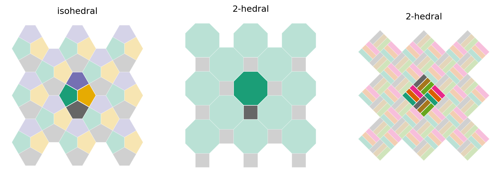

# Tiled maps
There is scope for 2 papers in the first instance:

+ [Tiling as an approach to multivariate maps](#paper-1-tiling-as-an-approach-to-multivariate-maps)
+ [Families of tilings for multivariate maps](#paper-2-families-of-tilings-for-multivariate-mapping)
 
## Paper 1. Tiling as an approach to multivariate maps
Motivating example (see Chaves et al. 2022) and the prior art on hatching going back centuries, with some additional work on topics such as pattern, texture, and orientation (see _How Maps Work_ for an overview).

Emulating a woven pattern quickly devolved into the wider world of tiled patterns, where tilings that could be produced by weaving are termed _isonemal_ (Grünbaum and Shephard 1985, 1986, 1988; Zelinka 1983; Thomas 2013).

### Approaches to multivariate mapping

+ Small multiples (Tufte 1990, pp. 67-80)
+ Bivariate choropleths (Brewer 1994)
+ Trivariate choropleths (...)
+ Statistical glyphs on choropleths (...)
+ Multivariate symbols (e.g. Chernoff faces, Dorling 1992, 2012)
+ Multi-element patterns (e.g. categorical dot maps, see Jenks 1953)
 
### Pattern as a visual variable
And tiling and weaving as an approach to systematically generating pattern.

Pattern is a neglected visual variable, not well-defined. Indeed pattern itself is an ill-defined concept&mdash;being almost literally a case of 'you know it when you see it'! For example:

> "there seems to be not a single instance in the literature of a meaningful definition of ‘pattern’ that is, in any sense, useful" (Grünbaum and Shephard, p. 261).

Mathematical definitions emphasize precise symmetry and repetition, where more generalized notions emphasize 'similarity' (in the non-mathematical meaning of that term).

### What kind of visual variable is a tiling?
For mathematicians one of the key features of interest in a tiling is its symmetries, i.e. transformations such as translation, rotation, scaling, etc., under which tiles in the tiling are mapped onto copies of themselves.

The transitivity groups of a tiling are sets of tiles mapped onto one another by the tiling's symmetries. An $n$-hedral tiling is one with $n$ symmetry groups. At a minimum a tiling should be able to symbolise $n$ variables, since each group is distinct and identifiable as such by a map reader. In practice where mathematicians consider rotated copies of a tile to be identical (hence members of the same transitivity group), in cartographic settings this is likely not the case, hence symmetry in our application is a more restricted concept than in mathematics. 

Hence an $n$-hedral tiling may support more than $n$ variables in a map (e.g. Cairo, which is isohedral, but has 4 distinct orientations, left hand example below), or a basket weave style tiling of rectangles, where each orientation might carry different information (the 2-hedral tiling in the right hand panel could symbolize 6 variables). 

[_It's likely not productive to mathematically formalize this intuition, as I am unsure where we would go with that._]

### Some examples
Taking care not to repeat ourselves - so it might make sense to stick with only one or two datasets and show a variety of tilings.

### Discussion
What we think are the advantages of this approach:

+ Capacity to handle several variables (maybe as many as 10? 12?)
+ Multivariate 'texture'
+ Breaking off boundaries
+ Visual linking of places

Challenges

+ ???

### Conclusions and future work

### References
+ Brewer CA. 1994. Color use guidelines for mapping and visualization. In _Visualization in Modern Cartography_, ed. AM MacEachren and DRF Taylor, 123–147. Tarrytown, NY: Elsevier Science. doi: [10.1016/B978-0-08-042415-6.50014-4](https://dx.doi.org/10.1016/B978-0-08-042415-6.50014-4).
+ Chaves LF, MD Friberg, LA Hurtado, R Marín Rodríguez, D O’Sullivan, and LR Bergmann. 2022. Trade, uneven development and people in motion: Used territories and the initial spread of COVID-19 in Mesoamerica and the Caribbean. _Socio-Economic Planning Sciences_ **80**, 101161. doi: [10.1016/j.seps.2021.101161](https://dx.doi.org/10.1016/j.seps.2021.101161).
+ Dorling D. 1992. Stretching space and splicing time: From cartographic animation to interactive visualization. _Cartography and Geographic Information Systems_ **19**(4), 215–227. doi: [10.1559/152304092783721259](https://dx.doi.org/10.1559/152304092783721259).
+ Dorling D. 2012. _The Visualization of Spatial Social Structure_. Chichester, England: Wiley.
+ Grünbaum B and GC Shephard. 1985. A catologue of isonemal fabrics. _Annals of the New York Academy of Sciences_ **440**(1 Discrete Geom), 279–298. doi: [10.1111/j.1749-6632.1985.tb14560.x](https://dx.doi.org/10.1111/j.1749-6632.1985.tb14560.x).
+ Grünbaum B and GC Shephard. 1986. An extension to the catalogue of isonemal fabrics. _Discrete Mathematics_ **60**, 155–192. doi: [10.1016/0012-365X(86)90010-5](https://dx.doi.org/10.1016/0012-365X(86)90010-5).
+ Grünbaum B and GC Shephard. 1987. _Tilings and Patterns_ (WH Freeman and Company, New York)
+ Grünbaum B and GC Shephard. 1988. Isonemal Fabrics. _American Mathematical Monthly_ **95**(1), 5–30. doi: [10.1080/00029890.1988.11971960](https://dx.doi.org/10.1080/00029890.1988.11971960).
+ Jenks GF. 1953. ‘Pointilism’ as a cartographic technique. _The Professional Geographer_ **5**(5), 4–6. doi: [10.1111/j.0033-0124.1953.055_4.x](https://dx.doi.org/10.1111/j.0033-0124.1953.055_4.x).
+ MacEachren AM. 1995. _How Maps Work: Representation, Visualization and Design_. New York: Guilford Press.
+ Olson RK and F Attneave. 1970. What Variables Produce Similarity Grouping? _The American Journal of Psychology_ **83**(1), 1–21. doi: [10.2307/1420852](https://dx.doi.org/10.2307/1420852).
+ Thomas R. 2013. Colouring isonemal fabrics with more than two colours by thick striping. Contributions to Discrete Mathematics **8**(1), 38-65. doi: [10.11575/CDM.V8I1.62180](https://dx.doi.org/10.11575/CDM.V8I1.62180).
+ Tufte ER. 1990. _Envisioning Information_. Cheshire, CT: Graphics Press.
+ Zelinka B. 1983. Isonemality and mononemality of woven fabrics. _Applications of Mathematics_ **28**(3), 194–198. doi: [10.21136/AM.1983.104026](https://dx.doi.org/10.21136/AM.1983.104026).

---

## Paper 2. Families of tilings for multivariate mapping
A cataloguing of families of tilings that seem likely to have value for mapping.

### 'Traditional' tilings

### Weaves
These have particularly strong directional character.

#### Biaxial
#### Triaxial

### Polyominoes and dissections
These offer a wider range of possible values of 'n'.

### Other?
#### Aperiodic
#### ??

